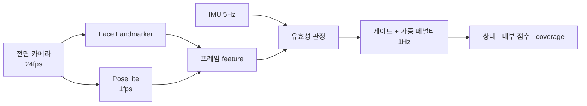
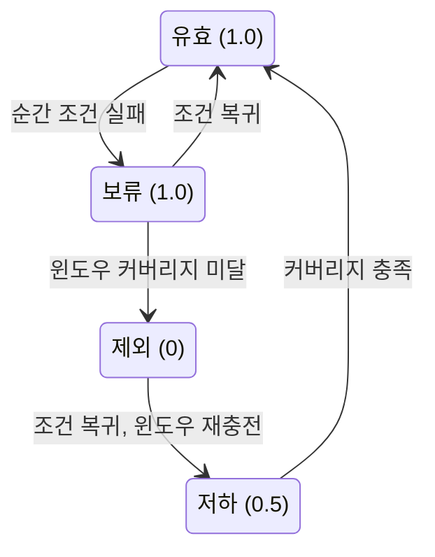

# 스마트폰 카메라 기반 집중도 측정 — 구현 스펙 v0.2

v0.2.0 · 2026-09-19 · 김요섭 · 알고리즘 설계 기준선

## v0.2 변경 요약

v0.2의 목표는 집중도를 맞히는 것이 아니라, 관찰 가능한 비집중·부재·졸음 신호를 오탐을 억제하며 안정적으로 측정하는 것이다. 실제 집중도와의 관계는 프로브 데이터로 이후 검증한다.

| 영역 | v0.1 | v0.2 |
| --- | --- | --- |
| 점수 수식 | s = base × (1 − P) | 100을 곱하고 p\_i와 P를 clamp. max 항과 가중치에 측정 품질 q 반영 |
| G1 부재 | 얼굴 미검출 3초 | 얼굴 + Pose 상체 2단 판정. 엎드림(수면)과 무효를 분리 |
| G3 수면 | 감김 2초 또는 PERCLOS ≥ 0.30 | 이 신호들은 W1 증거로 내림. G3는 두 번째 증거가 있을 때만 진입, 진입/해제 히스테리시스 |
| G2 이탈 | pitch 2군집까지 | (yaw, pitch) 최대 3개 영역, 사용자 등록 방식. 하드 게이트는 head pose만 쓰고 eyeLook은 그림자 기록 |
| W3 깜빡임 | 가중 0.15 | 그림자 지표(가중 0). 측정·기록만 |
| conf | Σ상태값 / 8, 세션 가중 평균 | scoring\_coverage로 개명, 세션 점수는 단순 평균 |
| 24fps | 운용 fps | W3 검증용 데이터 수집 fps |
| 0–100 점수 | 사용자 출력 | 프로브 검증 전까지 내부 지표 |
| 판정 순서 | 정의 없음. 부재 초가 coverage 조건에 걸려 무효로 빠질 수 있었음 | 게이트 확정 → coverage 검사 순서를 명시. 확정된 게이트는 coverage 부족으로 취소되지 않음 |
| 사용자 상태 | 정의 없음 | 상태 우선순위, 졸음 임계값, 집중 시간 비율 정의. 머리가 안 보이는 구간은 0점 대신 무효 + 자동 일시정지 |
| 졸음 상태 | 정의 없음 | 점수용 W1(60초)과 분리. 30초 안 졸음 사건 2회 또는 지속 PERCLOS로 판정 |
| 작업영역 갱신 | 신뢰 구간 데이터로 천천히 자동 갱신 | 세션 중 geometry 고정. 조정은 다음 세션에 사용자 확인 후 |
| 검증 설계 | 프로브 + 로지스틱 회귀 | participant 단위 split, W3 증분 비교(AUROC·log-loss·Brier), 프로브 target = 직전 10초 |
| 환경 무효 판정 | 얼굴 ROI 휘도 | 사람과 무관한 scene quality proxy 추가 (전체 프레임 휘도, 배경 tile 기반 카메라 가림). 지터는 강체 잔차 j로 정의 |
| 기록 계약 | 초당 feature 벡터만 저장 (필드 미정) | 초당 기록 스키마와 그림자 지표(W3, G2\_shadow)의 값·valid·coverage 계약 명시 |
| 구현 계약 | 없음 | monotonic clock, 소급 규칙(raw\_state / final\_state), 세션 header(버전·parameter\_set\_id), v0.2.x 변경 관리 (9장) |
| 데이터 경계 | 여러 장에 서술로만 존재 | 데이터 종류별 메모리·저장·전송·보존 표와 강제 규칙 (9장) |
| 기타 |  | 깜빡임 최소 80ms, EAR 구간 준비 기준, m0 하한, 폰 재거치 확정 조건, 측정 품질 proxy 정의 |

## 1. 개요와 전제

스마트폰 전면 카메라 하나로 상반신\~얼굴을 관찰해 초 단위 상태(집중/이탈/폰 사용/부재/졸음), 내부 점수(0–100), coverage를 산출한다. 품질이 떨어진 신호는 나쁘게 측정하지 않고 제외하며, 남은 항목으로 재정규화한다. 0–100 점수는 프로브 검증 전까지 사용자에게 공개하지 않는 내부 지표다.

**전제**

- 폰은 거치대에 고정한다. 전면 카메라, 얼굴까지 40–80cm, 정면 ±30° 이내.
- 눈높이 아래에 두고 위를 향하게 한다. 숙인 자세에서도 얼굴과 눈이 보인다.
- 시선 타깃은 폰 화면이 아니라 책·노트북이다. 폰 화면으로 강의를 보는 경우는 지원하지 않고, 측정 중 폰은 센서로만 쓴다. "화면 응시율" 대신 캘리브레이션으로 잡는 작업영역을 쓴다.
- 전부 온디바이스로 처리한다. 영상·이미지 프레임·원시 랜드마크는 영구 저장하거나 외부 전송하지 않는다. 저장 가능한 데이터는 9장 데이터 경계에 정의한 초당 레코드(파생 수치), 캘리브레이션 스냅샷, 세션 메타데이터, 집계값으로 제한한다.

**파이프라인**

| 구성 | 실행 주기 | 산출 |
| --- | --- | --- |
| MediaPipe Face Landmarker (num\_faces = 1, blendshape on) | 24fps (미지원 기기는 30fps), 하한 20 | 478 랜드마크, 52 blendshape, transformation matrix |
| Pose Landmarker lite | 1fps | 어깨·손목·머리 랜드마크 (자세, 손 가림, 상체 존재 판정). 얼굴 미검출 중에는 3fps로 올림 |
| IMU 가속도계 | 5Hz | 폰 흔들림·집어 듦 감지 |
| 스코어러 | 1Hz | 초당 상태, 내부 점수, coverage |



**설계 원칙**

1. 결정적 신호(부재·수면·이탈)는 게이트로, 나머지는 가중 페널티로 처리한다.
2. 모든 판단은 절대값이 아니라 개인 baseline 대비 편차로 한다.
3. "측정 불가"와 "비집중"을 분리한다. 무효 구간은 0점이 아니라 평균에서 제외한다.
4. 절전은 평가 불가능한 상태에서만 연산을 줄인다. 정상 측정 중에는 fps를 깎지 않는다.

## 2. 지표 선정

스마트폰 카메라로 안정적으로 잴 수 없는 지표 7종을 걷어내고, 남은 신호를 게이트 3개, 가중 항목 4개, 그림자 지표 2개로 묶는다.

**제거한 지표**

| 지표 | 제거 이유 | 대체 |
| --- | --- | --- |
| rPPG (HR/HRV) | 정면 500lux 이상, 30fps 이상, 머리 고정이 필요. 폰의 자동노출·화이트밸런스가 신호를 깨뜨림 | 없음 |
| 동공 크기 | 해상도 부족, 조도 변화와 분리 불가 | 없음 |
| 정밀 시선 좌표 | 오차가 수 도 단위 | 거친 방향(eyeLook)은 그림자 지표로 기록만 |
| ms 단위 깜빡임 지속시간 | 정상 깜빡임 100–400ms가 30fps에서 3–12프레임 | 횟수와 0.5초 이상 긴 감김만 유지 |
| 미세 표정·감정 (browDown 등) | 몰입과 혼란을 구분하지 못함 | 하품·말하기만 유지 |
| pose z값 기울임 | 단안 z가 불안정 | 얼굴 크기(양안 거리 px) 비율 |
| 턱 괴기 (hand 모델) | 모델 비용 대비 의미가 모호 | Pose 손목 위치로 가림 판정만 |

**평가 항목 (점수 항목 7개 + 그림자 지표 2개)**

| 항목 | 유형 | 필요 신호 |
| --- | --- | --- |
| G1 부재·엎드림 | 게이트 | 얼굴 검출 + Pose 상체·머리 검출 |
| G2 이탈 | 게이트 | head pose, 폰 사용(IMU·앱 상태) |
| G3 수면 | 게이트 | 눈 감김 증거 + 두 번째 증거(고개 떨굼, 저움직임) |
| W1 졸음 | 가중 0.40 (재정규화 후 0.47) | PERCLOS, 긴 감김, 하품, 고개 떨굼 |
| W2 움직임 | 가중 0.25 (0.29) | 코끝 변위 |
| W4 자세 | 가중 0.10 (0.12) | 얼굴 크기, roll, 어깨선, 귀–어깨 거리 |
| W5 말하기 | 가중 0.10 (0.12) | jawOpen 변동 |
| W3 깜빡임 | 그림자 (가중 0) | 깜빡임 빈도 (fps 20 이상). 측정·기록만 하고 점수에 넣지 않음 |
| G2\_shadow 거친 시선 | 그림자 | eyeLookIn/Out/Up의 baseline 대비 편차. 기록만 하고 게이트에 쓰지 않음 |

**W3를 점수에서 뺀 이유**

- 읽기 중 mind wandering의 시선 지표 메타분석(Mézière 외, Memory & Cognition)에서 유의했던 지표는 단어 건너뛰기와 단어당 고정 횟수뿐이고, blink count는 유의하지 않았다. 단일 연구(Smilek 외, 2010)에 기댄 가중 0.15는 근거가 약하다.
- 다만 지표당 데이터셋이 3–8개뿐이라 효과가 없다고 단정할 수도 없다. 측정과 기록은 계속하고, 프로브 라벨에서 다른 변수 위에 추가 예측력을 보일 때만 되살린다.
- 되살리더라도 시각 과제에 한정한다. 청취형 과제에서는 인지부하가 오를 때 깜빡임이 늘어 방향이 반대다.

## 3. 점수 구조

초당 점수는 게이트가 정하는 base에 가중 페널티 P를 곱해 만든다. 단순 가중합은 쓰지 않는다. 이탈 가중치가 0.3이면 30초 내내 딴 데를 봐도 70점이 나오기 때문이다. 이 점수는 프로브 검증 전까지 내부 지표다.

```
p_i     = clamp(p_i, 0, 1)
P       = clamp(0.5·max(q_i·c_i·p_i) + 0.5·Σ(w'_i·p_i), 0, 1)
score_t = 100 × base × (1 − P)
ramp(x, lo, hi) = clamp((x − lo)/(hi − lo), 0, 1)
```

- q\_i는 측정 품질이다. prior baseline을 쓰는 중이거나 윈도우를 재충전하는 중이면 0.5, 정상이면 1이다 (6장).
- w'는 6장에서 재정규화한 가중치다. max 항은 유효 항목만 대상으로 한다.
- κ(증거원 가용성)는 max 항에 넣지 않는다. 같은 고개 떨굼이 눈이 보일 때와 안 보일 때 다른 크기의 페널티가 되면 안 된다.

**판정 순서 (초 단위)**

위에서부터 검사하고, 먼저 확정된 것이 그 초의 상태다. 확정된 게이트는 coverage 부족 때문에 취소되지 않는다.

1. 폰 사용 확정 → PHONE, score 0
2. 환경이 측정 불가(저조도, 카메라 가림, fps < 10, 품질 proxy 초과, 폰 흔들림, 재캘리브레이션) → INVALID
3. G1 부재 확정 → ABSENT, score 0
4. G1 엎드림 확정 → PRONE, score 0
5. G3 수면 확정 → SLEEP, score 0
6. G2 장기 이탈 → AWAY, score 0
7. G2 단기 이탈 → AWAY, score = 50 × (1 − P). P는 유효 항목만으로 계산하고, 유효 항목이 없으면 0으로 둔다
8. 그 외에만 평가 가능 조건(6장)을 검사한다
9. 통과하면 score = 100 × (1 − P)이고 상태는 DROWSY 또는 FOCUS다. 실패하면 INVALID다

- 2번이 3번보다 앞인 이유: 어두운 방에서는 얼굴과 상체가 둘 다 안 잡혀 부재처럼 보인다.
- 2번의 저조도·가림 판정은 얼굴 검출과 무관한 scene quality proxy로 한다 (6장). 얼굴 ROI 휘도만 쓰면, 어두워서 얼굴 검출이 실패한 바로 그 상황에서 proxy 자체가 존재하지 않는다.
- 얼굴이 안 보이는데 부재·엎드림으로 확정되지 않은 초는 INVALID다 (아래 G1 규칙).

**게이트와 base**

| 상태 | 조건 | base |
| --- | --- | --- |
| 부재 | 얼굴 미검출 + Pose 상체 미검출이 3초 이상 연속 | 0 |
| 엎드림 | 얼굴 미검출 + 상체 검출 + 머리 landmark가 어깨선 아래 + 저움직임 30초 이상 (아래 G1 규칙) | 0 |
| 수면 | G3 진입 조건 충족 (아래 G3 규칙) | 0 |
| 폰 사용 | 집어 듦(기울기 변화 > 15° 또는 손에 든 수준의 가속도 분산이 3초 이상 지속), 또는 세션 중 우리 앱이 포그라운드가 아닌데 폰이 잠금 해제 상태 | 0 |
| 이탈 (단기) | 등록된 모든 작업영역 밖 4–15초 | 0.5 |
| 이탈 (장기) | 등록된 모든 작업영역 밖 15초 초과 | 0 |
| 정상 | 그 외 (4초 미만 이탈은 유예) | 1 |
| 무효 | fps < 10, 저조도, 카메라 가림, 측정 품질 proxy 초과(6장), 3초 미만의 폰 흔들림, 재거치 확정 전 60초, 재캘리브레이션 구간, 얼굴 미검출인데 부재·엎드림으로 확정되지 않은 구간 | 평균에서 제외 |

**G1: 얼굴이 안 보일 때**

얼굴 미검출만으로 부재를 확정하지 않는다. 깊이 숙이거나 손으로 가리거나 책에 붙는 순간이 모두 부재가 되기 때문이다. 얼굴이 사라진 동안 Pose를 3fps로 올려 아래처럼 나눈다.

| 얼굴 | 상체 (Pose) | 추가 조건 | 판정 |
| --- | --- | --- | --- |
| ✗ | ✗ | 3초 이상 연속 | 부재 (base 0) |
| ✗ | ✓ | 움직임 있음 | 무효 |
| ✗ | ✓ | Pose의 nose/ear 중 유효 landmark가 있고 head\_y > shoulder\_line\_y + margin, 저움직임 30초 이상 | 엎드림 (base 0) |
| ✗ | ✓ | 머리 landmark 없음 | 무효. 0점을 만들지 않는다 |

- 상체 검출 조건: 양 어깨 visibility ≥ 0.6, 그리고 어깨 중심과 어깨 폭이 캘리브레이션 torso ROI와 일치해야 한다(위치 편차 < 어깨 폭의 50%, 크기 비율 0.6–1.6). 빈 의자나 걸어 둔 옷을 사람으로 잡는 오탐을 막는다.
- 이미지 y는 아래로 갈수록 커진다. margin은 어깨 폭의 15%다.
- 저움직임은 어깨 중심의 1초 간격 변위 ÷ 어깨 폭이 0.3·m0\_pose 미만인 상태다. m0\_pose에도 하한을 둔다 (4장).
- 머리 landmark가 없으면 수면인지 알 수 없다. "측정 불가와 비집중을 분리한다"는 원칙대로 무효로 두고, 증거가 생기면 그때 엎드림이나 G3로 넘긴다. 점수 부풀림은 증거 없는 0점이 아니라 coverage와 일시정지로 드러낸다.
- 머리 landmark 없는 얼굴 미검출이 저움직임으로 이어지면, 30초에 "카메라 위치를 조정해 주세요" 알림(진동·소리)을 보내고 120초에 세션을 자동 일시정지한다. 얼굴이 3초 이상 다시 검출되면 자동 재개한다. 일시정지 시간은 세션 시간에서 빼고 따로 기록한다.
- 해제 히스테리시스: ABSENT는 얼굴 또는 캘리브레이션과 일치하는 상체가 1초 연속 유효하면 해제한다. PRONE은 얼굴이 1초 연속 재검출되거나, 머리가 엎드림 조건에서 벗어나고 움직임이 2초 이상 확인되면 해제한다. 1–3fps Pose의 한 프레임짜리 검출로 상태가 흔들리는 것을 막는다.

**G3: 수면 진입과 해제**

2초 이상 감김과 높은 PERCLOS만으로는 수면을 확정하지 않는다. 눈을 감고 생각하는 경우와 구분할 근거가 없고, 흔히 인용되는 임계값(PERCLOS ≥ 0.3, 감김 ≥ 2초)은 수면무호흡 운전자의 운전 시뮬레이션에서 나온 졸음 정의다. 이 신호들은 W1의 증거로 쓰고, G3는 두 번째 증거가 있을 때만 진입한다.

```
LC = 2초 이상 10초 미만의 감김 사건 (종료 시각 기준, 실제로 관측된 것만)

G3 진입 (하나라도):
  A. 연속 눈 감김 ≥ 10초
  B. LC와 고개 떨굼의 시간 간격 ≤ 10초
  C. 현재 저움직임(움직임 < 0.3·m0)이 30초 이상 지속
     AND 최근 30초 구간 안에서
         LC가 있거나,
         유효 눈 시간 ≥ 15초이고 PERCLOS(최근 30초) ≥ 0.30

G3 해제 (모두):
  눈 열림(r < 0.3) 5초 연속
  AND (움직임 ≥ 0.5·m0 OR head pose가 작업영역 안)

재진입: 해제 후 30초 동안은 A로만
```

- 두 번째 증거는 시간상 붙어 있어야 한다. "같은 60초 창 안에 있었다"만으로는 결합하지 않는다. 2초 눈을 감고 생각한 뒤 40초 후에 목을 한 번 숙이는 것은 수면이 아니다.
- C는 저움직임 episode 전체가 아니라 현재 시점에 붙은 최근 30초만 본다. episode에 상한이 없으면, 조용히 몇 분째 책을 읽는 사람이 한참 전에 한 번 눈을 감았다는 이유로 뒤늦게 수면이 된다. C가 묻는 것은 "지금 30초 동안 거의 움직이지 않으면서 눈 감김 증거가 함께 있었나"다.
- C의 PERCLOS 분기에만 최소 유효 눈 시간을 둔다. 30초 중 눈이 4초만 유효했고 그중 2초가 감김이면 PERCLOS가 0.50이 되어 버린다. LC는 관측된 사건이라 이 조건이 필요 없다.
- 10초 간격, 30초 구간, 15초 유효 시간은 검증 전 초기값이다.
- 진입과 해제 조건을 다르게 둔 것이 히스테리시스다. PERCLOS 0.29에서 0.30으로 넘어가는 순간 30점이 0점으로 떨어지던 절벽도 없어진다.
- 재진입 제한은 깨자마자 과거 데이터 때문에 다시 수면으로 들어가는 것을 막는다.
- 눈이 제외된 상태에서는 6장의 fallback 규칙을 따른다. fallback도 같은 원칙을 지킨다. 관측하지 못한 감김을 LC로 승격하지 않고, 저움직임 기준은 본문과 같은 30초다.

**폰 사용 게이트**

- 폰 화면 사용을 지원하지 않으므로 세션 중 폰 사용은 예외 없이 base 0이다. 카메라 신호 없이 IMU와 앱 상태만으로 확정한다.
- 가속도 분산 기준은 캘리브레이션 때 잰 거치 상태 값의 3배다.
- 집어 듦 판정 뒤에는 재거치를 자동으로 확정하지 않는다. 중력 벡터가 캘리브레이션 때의 거치 자세 ±10° 안으로 돌아와 정지하거나, 사용자가 '재거치 완료'를 탭했을 때만 확정하고 재캘리브레이션한다.
- 확정 전 60초까지는 무효, 그 뒤로는 폰 사용으로 집계한다. 폰을 집어 평평한 곳에 내려놓고 쓰는 경우를 재거치로 오인하지 않기 위해서다.
- iOS는 백그라운드에서 코드가 돌지 않는다. 복귀 시점에 이탈·복귀 타임스탬프로 그 구간을 interval 레코드로 만들어 base 0으로 채운다 (9장 lifecycle gap).
- 10분 넘게 복귀하지 않으면 이탈 시점에 세션을 종료한다.
- Android에서 알림으로 화면만 켜진 경우는 잠금 해제가 아니므로 폰 사용으로 보지 않는다.
- iOS에서 화면 잠금으로 측정이 멈춘 경우는 폰 사용이 아니라 세션 일시정지(무효)로 구분한다. 구분 방법은 8장 검증 항목이다.

**G2: 이탈**

이탈은 head pose가 등록된 모든 작업영역 밖일 때다. 작업영역은 최대 3개다 (4장). v0.2에서 G2 하드 게이트는 head pose만 쓴다. 2장에서 정밀 시선을 뺀 것과 같은 이유로, 거친 시선(eyeLook) 하나가 단독으로 상태를 바꾸게 두지 않는다. eyeLookIn/Out/Up의 baseline 대비 편차는 G2\_shadow로 기록하고, 프로브 데이터에서 증분 예측력을 먼저 검증한다. 4초 유예와 0.5 단계는 프로브 라벨로 조정할 초기값이다.

**가중 페널티** (w = 명목 가중치, w' = W3 제외 후 재정규화, c = 단독 최대 영향)

| 항목 | w | w' | c | p 계산 | 윈도우 |
| --- | --- | --- | --- | --- | --- |
| W1 졸음 | 0.40 | 0.47 | 1.0 | max(ramp(PERCLOS, 0.08, 0.25), 0.3 × 긴 감김 횟수 + 0.6 × 2초 이상 감김 횟수, 0.5 × 하품, 0.5 × 고개 떨굼) | 60s |
| W2 움직임 | 0.25 | 0.29 | 0.6 | ramp(m\_eff / m0, 1.5, 4) | 10s |
| W4 자세 | 0.10 | 0.12 | 0.4 | 자세 플래그가 켜진 시간 비율 | 30s |
| W5 말하기 | 0.10 | 0.12 | 0.6 | jawOpen 변동이 baseline 3배 이상인 시간 비율 | 10s |
| W3 깜빡임 (그림자) | 0 |  |  | ramp(BR / BR0, 1.3, 2.5)를 계산해 기록만 한다 | 60s |

모든 p\_i는 계산 뒤 \[0, 1\]로 clamp한다. 긴 감김이 4회면 0.3 × 4 = 1.2가 되기 때문이다.

**하위 정의**

- PERCLOS: 눈이 80% 이상 감긴 시간 비율.
- 감김 사건은 지속시간 d로 배타적으로 나눈다. 0.5 ≤ d < 2.0초는 긴 감김(회당 0.3), 2.0 ≤ d < 10.0초는 LC(회당 0.6), d ≥ 10.0초는 G3-A다. 한 사건은 한 구간에만 속한다.
- 횟수는 60초 윈도우 안에서 실제로 관측된 raw count다. 유효 시간으로 나눠 보정하지 않는다. 관측하지 못한 시간의 사건을 추정하지 않기 위해서다.
- 하품: jawOpen > 0.6이 2.5초 이상. 고개 떨굼: pitch 15° 이상 하강 후 급복귀.
- W1의 q: p\_W1 = max\_k(p\_k)를 실제로 결정한 하위증거 k\*의 q를 쓴다. 눈 baseline이 prior면 q\_eye = 0.5, fallback 증거 F는 0.5다. 하품(jaw landmark)과 고개 떨굼(face transformation)의 q는 얼굴 추적 품질 q\_face를 따른다 (6장). 모든 p\_k가 0이면 유효한 하위신호의 κ 가중 평균 q를 쓴다.
- m: 코끝 변위 ÷ 양안 거리. 프레임 번호가 아니라 timestamp 기준으로 계산한다. t와 t − Δ의 위치를 인접 프레임에서 선형 보간해 변위를 구한다.
- Δ = 1/6초(약 167ms). 12·24·30fps 모두에서 정수 프레임이라 보간 오차가 가장 작고, 24fps 데이터를 12fps로 다운샘플해도 같은 정의가 성립한다. m\_eff = max(0, m − 지터 바닥값). 지터 바닥값은 캘리브레이션에서 잡아 세션 중 고정한다. 런타임 품질은 6장의 강체 잔차 j로 판정한다.
- m0 하한: m0 = max(캘리브레이션 중앙값, 지터 바닥값). 매우 정적인 사람의 m0가 0에 가까워져 비율이 폭주하는 것을 막는다.
- 자세 플래그: 얼굴 크기 s/s0 < 0.75, head roll 편차 > 20°, 어깨선 기울기 > 12°, 귀–어깨 거리 20% 감소.
- BR0: 캘리브레이션 값으로 시작하고 세션 간 누적해 갱신한다 (그림자 기록용).

항목 하나만 최대일 때 점수는 졸음 26, 움직임 55, 말하기 64, 자세 74점이다.

**초 단위 상태와 우선순위**

한 초에 여러 조건이 성립하면 판정 순서대로 앞선 것이 그 초의 상태다.

```
PHONE > INVALID(환경) > ABSENT > PRONE > SLEEP > AWAY > DROWSY > FOCUS
```

| 상태 | 정의 | 사용자 표시 |
| --- | --- | --- |
| PHONE | 폰 사용 게이트 | 폰 사용 |
| ABSENT | G1 부재 | 부재 |
| PRONE, SLEEP | G1 엎드림, G3 수면 | 수면 |
| AWAY | G2 이탈 (단기·장기 모두) | 이탈 |
| DROWSY | 평가 가능한 초 중 아래 졸음 상태 조건을 만족 | 졸음 |
| FOCUS | 평가 가능한 초 중 나머지. 4초 미만의 유예 이탈 포함 | 집중 |
| INVALID | 측정 불가 | 표시하지 않음. 분모에서 제외 |

**DROWSY는 점수용 W1과 따로 판정한다**

```
졸음 사건   = 긴 감김, LC, 하품, 고개 떨굼
감김 episode = r ≥ 0.8이 0.3초 이상 이어진 구간. 1초 이상 눈을 뜬 뒤의 감김은 별개의 episode

진입: 최근 30초 안에 졸음 사건 2회 이상
      OR (PERCLOS(30s) ≥ 0.15
          AND 최근 30초 안에 감김 episode 2회 이상
          AND 그 30초의 유효 눈 시간 ≥ 15초)
해제: 최근 20초 안에 졸음 사건 0회
      AND PERCLOS(30s) < 0.10
```

- 분석용 feature 윈도우와 사용자에게 보이는 상태의 지속시간은 다른 개념이다. W1은 60초 윈도우라 2초 감김 한 번이 p\_W1 = 0.6을 60초 동안 유지시킨다. p\_W1 임계값으로 상태를 정하면 눈 감고 생각한 한 번이 1분짜리 '졸음'이 된다.
- 단일 사건은 상태가 아니다. PERCLOS 분기에도 감김 episode 2회 조건을 둔 이유다. 이 조건이 없으면 유효 눈 시간 15초에서 2.25초짜리 LC 한 번으로 PERCLOS가 0.15가 된다.
- PERCLOS 분기는 0.3–0.5초짜리 느린 깜빡임이 반복되는 경우를 잡는다. 이런 감김은 긴 감김(0.5초 이상)에 못 미쳐 졸음 사건으로 세어지지 않는다.
- 4–5초짜리 감김 한 번은 점수(W1)에는 반영되지만 사용자 상태는 바꾸지 않는다.
- 수치(30초, 2회, 0.3초, 0.15, 0.10, 20초)는 검증 전 초기값이다.
- FOCUS는 "집중이 확인됨"이 아니라 "비집중 신호가 관찰되지 않음"이다.

**집계와 출력**

```
집중 시간 비율 = FOCUS 초 / (FOCUS + DROWSY + AWAY + PHONE + ABSENT + PRONE + SLEEP 초)
세션 coverage  = (전체 − INVALID 초) / 전체 세션 초
```

- INVALID와 자동 일시정지 시간은 상태 비율의 분모에서 뺀다. 세션 coverage와 일시정지 시간은 따로 표기한다.
- 사용자에게 보여 주는 것: 상태 비율, 집중 시간 비율, 집중 시간(분), 세션 coverage.
- 세션 점수(내부): 평가 가능한 초의 단순 평균. coverage는 가중치로 쓰지 않는다 (6장).
- 내부·디버그 표시용: 30초 윈도우 + EMA(α ≈ 0.2).
- 내부 기록: score\_t, 세션 점수, scoring\_coverage, 항목별 유효 시간 비율, W3\_shadow\_coverage, G2\_shadow\_coverage. 초당 기록 항목은 6장 스키마를 따른다.

## 4. 캘리브레이션과 작업영역

세션 시작 1–2분 동안 개인 baseline과 작업영역을 잡고, 이후 판단은 전부 이 값 대비 편차로 한다.

**수집 값**

| 값 | 방법 | 쓰이는 곳 |
| --- | --- | --- |
| EAR closed (전역) | "1초간 눈 감기" 1회 + 깜빡임 최저점 P20 | 5장 감김 비율 |
| EAR open (구간별) | 열린 상태 EAR의 P90 | 5장 |
| BR0 | 캘리브레이션 구간 깜빡임 빈도, 세션 간 누적 | W3 그림자 기록 |
| 작업영역 (최대 3개) | 자료 위치 등록: 사용자가 보는 곳마다 (yaw, pitch) 분포를 수집 | G2 |
| eyeLook baseline | 중앙값 | G2\_shadow 기록 (거친 시선) |
| m0, 지터 바닥값 | 움직임 중앙값, P10. m0 = max(중앙값, 지터 바닥값) | W2 |
| m0\_pose | 어깨 중심의 1초 간격 변위 ÷ 어깨 폭의 중앙값. m0\_pose = max(중앙값, Pose 지터 바닥값) | G1 저움직임 판정 |
| torso ROI | 어깨 중심 위치와 어깨 폭의 중앙값 | G1 상체 검출 |
| s0, roll0, 어깨선, 귀–어깨 거리 | 작업영역별 중앙값 | W4 |
| jawOpen 변동 | 표준편차 | W5 |
| 얼굴 폭 px | 중앙값 | 7장 해상도 선택, 6장 품질 proxy |
| 거치 자세 중력 벡터 | IMU 평균 | 폰 재거치 확정 (3장) |
| 거치 상태 가속도 분산 | IMU 분산 | 폰 집어 듦 판정 (3장) |
| scene quality 기준 | 전체 프레임 Y 평균, 사람 ROI 밖 배경 tile들의 texture 기준값, 강체 잔차 지터 j의 기준값 | 6장 scene quality proxy (저조도, 카메라 가림) |

**작업영역**

- 영역 = (yaw, pitch) 중앙값 ± max(12°, 2.5·MAD).
- 작업영역은 (yaw, pitch) 평면에서 최대 3개까지 둔다. 필기하다 옆 책을 보거나 두 번째 자료를 보는 것을 이탈로 잡지 않기 위해서다.
- 등록은 사용자 조작으로만 한다. 캘리브레이션의 "자료 위치 등록"에서 보는 곳(책, 노트북, 보조 자료)을 하나씩 등록하고, 세션 중 추가는 1탭으로 한다.
- 영역의 중심과 경계는 캘리브레이션 뒤 세션이 끝날 때까지 고정한다. 자동 갱신하지 않는다. "영역 안 → base 1 → 갱신 대상"이라는 순환 때문에, 경계 근처의 딴짓이 영역을 조금씩 끌고 가는 drift가 생길 수 있다.
- 세션 중 자동 갱신은 EAR, 자세 같은 개인 baseline에만 한다.
- 세션이 끝난 뒤 영역 조정 후보를 만들 수 있다. 적용은 다음 세션 시작 때 사용자 확인을 받은 뒤에만 한다.
- 최근 5분 중 이탈이 50% 이상이면 자리나 자세가 바뀐 것일 수 있으므로 영역 재등록을 안내한다.
- 자세 baseline은 영역별로 따로 저장한다.
- 재거치가 확정되면(3장) 작업영역, 얼굴 크기, 자세 baseline, torso ROI, scene quality 기준(휘도, 배경 tile texture)을 다시 잡는다. 카메라 구도가 바뀌면 scene 기준도 무효가 된다. 이 구간은 무효로 둔다.

**순환 의존 처리**

baseline이 점수를 만들고, 점수가 baseline 갱신 자격을 정한다. 갱신 자격은 직전 초의 점수로 판정하고(1스텝 지연), 부트스트랩은 캘리브레이션 값으로 한다.

## 5. EAR 각도 구간 로직

EAR은 고개를 숙이거나 눈을 내리깔면 떨어져 감김으로 오인되므로, 각도 구간별 baseline으로 판정하고 판별이 안 되는 구간은 눈 신호를 일시 제외한다. 입력은 transformation matrix에서 뽑은 카메라 기준 상대각이다: θ = pitch(음수 = 카메라 기준 아래로 숙임), ψ = yaw, φ = roll.

**구간 키**

키 = (θ 10° 구간, ψ 3단계, 하방시선 2단계).

- ψ 3단계: < −15° / 중앙 / > +15°. |ψ| > 15°면 카메라에 가까운 쪽 눈만 쓴다. 먼 쪽 눈은 가로폭이 눌려 EAR이 부풀려진다.
- 하방시선 2단계: eyeLookDown < 0.35 / ≥ 0.35. 머리는 정면인데 눈만 내리깔아도 EAR이 떨어지기 때문이다.
- 구간 전환에는 ±2° 히스테리시스를 둔다.

**1단계: 하드 제외** (하나라도 해당하면 눈 신호 무효)

- θ < −25° 또는 θ > +30°, |ψ| > 35°, |φ| > 30°.
- 눈 가로폭 < 24px.
- |ψ| ≤ 15°인데 좌우 EAR 차 > 0.12가 0.5초 이상이면 한쪽 가림 또는 안경 반사다. 정상 쪽 눈만 쓰고, 양쪽 다 이상하면 무효.
- Pose 손목/손 랜드마크가 얼굴 상단 영역 안에 있을 때 (눈 비비기, 이마 짚기).

**2단계: 구간 baseline**

```
구간별: open   = 열린 상태 EAR의 P90
        σ      = 1.4826·MAD (열린 상태)
        t      = 유효 지속시간 (누적)
        visits = 서로 10초 이상 떨어진 방문 횟수
전역:   closed = 깜빡임 최저점의 P20
```

- 구간 준비는 프레임 수가 아니라 유효 지속시간과 방문 횟수로 판단한다. 24fps의 연속 72프레임은 독립 표본 72개가 아니라 거의 같은 상태의 반복이다.
- t ≥ 3초면 '저하'(q = 0.5)로 쓰기 시작한다. t ≥ 10초이고 visits ≥ 2면 '유효'(q = 1)로 올린다.
- 준비 전에는 준비된 구간들로 open(θ) = aθ² + bθ + c를 피팅해 prior로 쓴다. prior 사용 중에도 q = 0.5다.
- open(θ)는 인접 두 구간 중심값의 선형 보간으로 구한다. 구간 경계에서 값이 튀지 않는다.

**3단계: 판별력 검사** (개인화된 각도 제외)

```
gap = open − closed
d   = gap / σ
평가 가능: d ≥ 5 AND gap ≥ 0.08
```

미달 구간은 구간 단위로 제외한다. 눈이 작거나 반사가 심하면 유효 각도가 자동으로 좁아진다. 1단계의 고정 각도는 안전망이고 실제 기준은 이 검사다.

**4단계: 감김 비율과 이벤트**

```
r = clamp((open − EAR) / gap, 0, 1)
```

| 이벤트 | 조건 (d = 지속시간) | 쓰임 |
| --- | --- | --- |
| 감김80 | r ≥ 0.8 | PERCLOS |
| 깜빡임 | r ≥ 0.5 진입, r ≤ 0.3 해제, 80ms ≤ d < 500ms. 24fps에서 40ms는 1프레임이라 잡음과 구분되지 않으므로 최소 2프레임으로 시작하고 실측으로 조정 | W3 그림자 기록 |
| 긴 감김 | 0.5초 ≤ d < 2.0초 | W1 증거, 회당 0.3 |
| LC (2초 이상 감김) | 2.0초 ≤ d < 10.0초 | W1 증거, 회당 0.6. 단독으로는 수면을 확정하지 않는다 (3장 G3) |
| 연속 감김 10초 | d ≥ 10.0초 | G3 진입 조건 A |

구간은 서로 배타적이다. 한 사건은 한 구간에만 속한다.

EAR에는 시간 평활을 걸지 않는다. 짧은 깜빡임이 지워진다.

**baseline 갱신**

- 신뢰 프레임(base = 1, 졸음 p < 0.3, 눈 열림)에서만 갱신한다. 졸려서 반쯤 처진 눈을 baseline이 학습하면 PERCLOS가 잡히지 않는다.
- EMA τ = 5분. 세션 내 하한은 최초 준비값 × 0.85.

**제외 진입과 복귀**

- 무효 조건이 0.25초 지속되면 제외하고, 해당 프레임은 소급해서 무효 처리한다.
- 유효 조건이 1.0초 지속되면 복귀한다.
- r ≥ 0.5 상태에서 제외로 넘어가면 `closure_at_exit` 플래그를 세운다. 졸 때는 눈 감김과 고개 떨굼이 같이 오므로 6장의 수면 fallback으로 넘긴다.

**윈도우 커버리지** (유효 프레임만으로 계산)

| 지표 | 유효 | 저하 | 제외 |
| --- | --- | --- | --- |
| PERCLOS (60s) | 유효 눈 시간 ≥ 30s | 15–30s | < 15s |
| 긴 감김·LC 횟수 (raw count, 유효 시간으로 보정하지 않음) | ≥ 30s |  | < 30s |
| 깜빡임 빈도 = n × 60 / 유효시간 (W3 그림자 기록용) | fps ≥ 20인 유효 시간 ≥ 40s |  | < 40s |

- 프레임 갭이 80ms를 넘은 초는 깜빡임 계산에서 무효로 한다.
- 머리 회전 > 15°/s 또는 영역 전환 전후 ±0.3초의 깜빡임은 분자와 분모에서 모두 뺀다. 머리를 돌릴 때 동반되는 깜빡임(gaze-evoked blink)은 주의력과 무관하다.
- eyeBlink blendshape를 EAR 대신 쓰더라도 같은 교란을 받을 가능성이 높으므로 동일한 구간 로직을 적용한다.

## 6. 항목별 예외·제외 로직

항목마다 무효 조건을 두고, 무효면 제외한 뒤 남은 항목으로 재정규화한다. 점수 항목 7개 중 절반이 평가 불능이어도 점수를 낸다.

**세 가지 값의 역할**

| 값 | 의미 | 쓰이는 곳 |
| --- | --- | --- |
| κ\_i | 증거원 가용성. 항목의 하위신호 중 살아 있는 비중 | w\_eff |
| q\_i | 측정 품질. 살아 있는 증거가 제대로 측정됐는가. prior baseline 사용 중이거나 윈도우 재충전 중이면 0.5, 정상이면 1 | w\_eff, max 항 |
| state\_i | 유효 1.0 / 저하 0.5 / 제외 0. κ < 1 또는 q < 1이면 저하 | scoring\_coverage |

κ와 q를 분리한 이유는 둘이 다른 질문에 답하기 때문이다. κ는 "무엇이 보이는가", q는 "보이는 것을 얼마나 믿을 수 있는가"다. q는 가중합과 max 항 양쪽에서 같은 신호를 약화시키고, κ는 가중치 배분에만 쓴다.

**항목 상태**

| 상태 | 값 | 의미 |
| --- | --- | --- |
| 유효 | 1.0 | 순간 조건과 윈도우 커버리지를 모두 충족 |
| 보류 | 1.0 | 순간 조건은 실패했지만 윈도우 커버리지는 충족. 윈도우의 유효 구간만으로 계산 |
| 저하 | 0.5 | 하위신호 일부만 유효(κ < 1), prior 사용 중 또는 윈도우 재충전 중(q < 1) |
| 제외 | 0 | 커버리지 미달. 가중치 0 |



**측정 품질 proxy**

FaceLandmarkerResult에는 랜드마크별 신뢰도 값이 없다. detection·presence·tracking confidence는 옵션의 최소 통과 임계값일 뿐이다. 그래서 아래 proxy로 품질을 판정한다. 얼굴에 의존하는 proxy와 얼굴 없이도 계산되는 scene proxy를 나눈다.

| proxy | 기준 | 처리 |
| --- | --- | --- |
| 추적 끊김 | 최근 2초 안에 얼굴 재획득 발생 | W2 무효, 눈 항목 q = 0.5 |
| 얼굴 폭 | < 120px | 눈 신호 무효. < 80px면 프레임 무효 |
| 지터 j | 강체 잔차 j가 캘리브레이션의 2배 초과 | W2 무효. 3배 초과면 프레임 무효 |
| 좌우 EAR 비대칭 | \|ψ\| ≤ 15°에서 차이 > 0.12가 0.5초 이상 | 정상 쪽 눈만 사용. 양쪽 다 이상하면 눈 신호 무효 |
| scene 휘도 (사람 무관) | 전체 프레임의 Y-plane 평균 휘도 < 40/255 | 프레임 무효 (저조도) |
| 카메라 가림 (사람 무관) | 캘리브레이션 때 사람 ROI 밖이던 배경 tile의 80% 이상에서 texture가 각자 기준값의 25% 미만으로 동시에 떨어진 상태가 1초 이상 | 프레임 무효 (camera\_occluded) |

- scene proxy는 다운스케일한 Y plane(예: 64×48을 4×4 tile로 분할)에서 1–2Hz로 계산한다. texture는 tile 안 Y의 표준편차다. 판정 순서 2번에서 G1보다 먼저 검사한다.
- 가림 판정에는 사람이 있던 영역을 쓰지 않는다. 그 영역의 edge에는 얼굴 윤곽, 머리카락, 옷이 들어 있어서, 사람이 자리를 비우기만 해도 값이 무너져 부재가 가림으로 오분류된다. 배경 tile은 사람이 떠나도 변하지 않는다.
- 배경 tile의 기준 texture가 너무 낮으면(매끈한 벽이나 천장) 가림 proxy를 '사용 불가'로 두고 scene 휘도만 쓴다. 렌즈를 가리면 대개 어두워지므로 저조도로 잡힌다.
- 지터 j는 강체 운동을 제거한 뒤 남는 랜드마크 잔차다. transformation matrix의 역변환으로 랜드마크를 canonical face 공간으로 옮기고, 표정에 덜 움직이는 부분집합(콧등, 눈꼬리·눈머리, 이마)의 프레임 간 변위 RMS를 구한다.
- 실제 머리 움직임은 강체 변환에 흡수되어 j에 들어가지 않는다. 고개 떨굼이 클수록 q가 내려가거나, 산만하게 움직일수록 W2가 무효가 되는 역설을 막는다.
- q\_face: 추적 끊김 후 2초 이내, j가 캘리브레이션의 1.5배 초과, 얼굴 폭 < 120px 중 하나라도 해당하면 0.5, 아니면 1이다. 하품(jaw landmark)과 고개 떨굼(face transformation)의 q로 쓴다.

**항목별 무효·저하 조건**

| 항목 | 무효·저하 조건 | 커버리지 |
| --- | --- | --- |
| G1 부재·엎드림 | 프레임 무효: 저조도, 카메라 가림, 품질 proxy 초과, 3초 미만의 폰 흔들림, 재거치 확정 전 구간, 재캘리브레이션 구간, fps < 10. G1이 무효면 그 초 전체가 무효. 얼굴 미검출 시 판정은 3장 G1 규칙. 폰 사용 판정은 예외로, 카메라 신호 없이 base 0으로 확정한다 |  |
| G2 이탈 | head pose 신뢰 불가. 단 직전 1초 궤적이 영역 밖으로 향하던 중이면 이탈로 확정. 거친 시선은 게이트에 쓰지 않고 G2\_shadow로만 기록한다 (눈 유효 + \|ψ\| ≤ 25° + 눈폭 ≥ 30px일 때) |  |
| G3 수면 | 눈이 제외되면 fallback 모드 (저하) | 연속 감김 동안 유효성 유지 |
| W1 졸음 | 하위신호 비중 κ: 눈 0.6, 하품 0.2, 고개 떨굼 0.2. 유효한 하위신호만으로 max를 취하고, 일부만 유효하면 저하. q는 p\_W1을 결정한 하위증거의 q를 쓴다 (3장) | PERCLOS 기준 (5장) |
| W2 움직임 | 폰 움직임, 얼굴 재획득 후 1초, 영역 전환 ±1초, 강체 잔차 j가 캘리브레이션 기준값의 2배 초과 | 10s 중 60% 이상 |
| W4 자세 | 얼굴 기반(크기, roll)은 얼굴 추적 중 항상 유효. 어깨 기반은 양 어깨 visibility ≥ 0.6이고 Pose 결과가 3초 이내일 때만. 어깨가 무효면 κ 0.5 (저하) | 30s 중 60% 이상 |
| W5 말하기 | 입 가림: Pose 손목/손 랜드마크가 얼굴 하단 영역 안. 마스크는 세션 단위 제외. 말하는 과제면 끔 | 10s 중 60% 이상 |
| W3 깜빡임 (그림자) | 점수 항목이 아니다. 눈 유효, 실측 fps ≥ 20, 프레임 갭 ≤ 80ms일 때만 기록하고 W3\_shadow\_coverage로 집계 | 60s 중 40s 이상 |

**재정규화**

```
w_eff_i = w_i × κ_i × q_i      (제외면 0, W3는 항상 0)
W       = Σ w_eff_i
w'_i    = min(w_eff_i / W, 2 × w_eff_i)
```

- 모든 항목이 정상이면 w' = 0.47 / 0.29 / 0.12 / 0.12 (W1 / W2 / W4 / W5)다.
- 2배 상한은 약한 지표가 빈자리를 다 떠안고 점수를 흔드는 것을 막는다. 남는 가중치는 페널티 0으로 두고 coverage에 반영한다.
- q 저하는 가중합의 상대 가중치를 조정하고 max 페널티를 완화한다. prior로 측정한 약한 증거 때문에 강한 페널티를 주지 않기 위해서다. 따라서 품질이 낮을 때는 내부 점수가 다소 높아질 수 있고, 점수는 반드시 coverage와 함께 해석한다.

**평가 가능 조건 (초 단위)**

```
scoring_coverage_t = Σ state(G1, G2, G3, W1, W2, W4, W5) / 7

평가 가능 (3장 판정 순서 8번에서만 검사):
  G2 = 유효 AND scoring_coverage_t ≥ 0.50
```

- 이 조건은 게이트가 아무것도 확정되지 않은 초에만 적용한다. 폰 사용, 부재, 엎드림, 수면, 이탈로 확정된 초는 coverage와 무관하게 그 상태와 점수를 유지한다. 부재 중에는 head pose가 없어 G2가 제외되는데, 그 때문에 부재가 무효로 바뀌면 안 된다.
- 미달이면 그 초는 INVALID다. 0점이 아니라 평균과 상태 비율의 분모에서 제외한다.
- W3는 여기에 넣지 않고 W3\_shadow\_coverage로 따로 기록한다.
- scoring\_coverage는 독립 센서의 가용률이 아니라 점수 구성요소의 가용률이다. 같은 원천 신호가 여러 항목에 반영될 수 있다. 눈 신호가 죽으면 G3와 W1이 함께 내려간다.
- coverage는 통계적 신뢰도가 아니다. 사용자에게 "측정 신뢰도"로 표시하지 않는다. 실제 오차와의 관계를 검증한 뒤에야 보정된 confidence를 만들 수 있다.

**눈 제외 시 수면 fallback** (G3 저하 모드)

| 신호 | 조건 | 처리 |
| --- | --- | --- |
| F: 감김 중 제외 | `closure_at_exit` + 2초 내 θ 15° 이상 하강 | W1 fallback 증거 0.3, q = 0.5. LC로 승격하지 않는다 |
| F + 저움직임 | F 직후부터 움직임 < 0.3·m0가 30초 이상 연속 | G3 진입 |
| F + 고개 떨굼 | F와 별개의 고개 떨굼이 10초 이내 | G3 진입 |
| 고개 떨굼 반복 | 120초 안에 2회 이상 | p\_졸음 ≥ 0.5 |
| 처짐 | θ가 30초에 걸쳐 10° 이상 하강 + 움직임 < 0.3·m0 | W1 하위신호 0.5 |
| 장시간 정지 | 눈 제외 + 움직임 < 0.2·m0가 90초 이상 | 점수 유지, state(G3) = 제외로 내려 coverage에 반영. 깊은 독서와 졸음을 구분할 근거가 없다 |

fallback은 본문 G3의 우회로가 아니다. 제외 직전에 r ≥ 0.5였다는 것만으로는 2초 동안 감았다고 알 수 없으므로 F를 LC로 승격하지 않는다. 저움직임 기준도 본문 C와 같은 30초다.

**집계**

```
세션 점수      = mean(score_t | INVALID가 아닌 초)
세션 coverage  = (전체 − INVALID 초) / 전체 세션 초
평균 coverage  = mean(scoring_coverage_t | 평가 가능 조건을 검사한 초)
```

- coverage로 점수를 가중하지 않는다. 가중하면 고개 숙인 구간처럼 coverage가 낮은 시간의 비중이 검증 없이 깎인다.
- 자동 일시정지 시간은 전체 세션 초에 넣지 않고 따로 기록한다.
- 평균 coverage가 0.6 미만이면 거치 위치 조정을 안내한다.

**그림자 지표 기록 계약**

```
G2_shadow_dev_t    = max over {In, Out, Up} of (eyeLook_k − baseline_k), 초 평균
G2_shadow_dir_t    = 그 최대 방향 (In / Out / Up)
G2_shadow_valid_t  = 눈 유효 AND |ψ| ≤ 25° AND 눈폭 ≥ 30px인 프레임 비율
G2_shadow_coverage = Σ G2_shadow_valid_t / 세션 초 (일시정지 제외)

W3_blink_count_t   = 그 초에 끝난 깜빡임 수 (머리 회전 전후 ±0.3초 제외 후)
W3_valid_t         = 눈 유효 AND 실측 fps ≥ 20 AND 프레임 갭 ≤ 80ms인 시간 비율
W3_shadow_coverage = Σ W3_valid_t / 세션 초 (일시정지 제외)
```

그림자 지표는 v4에서 증분 예측력을 검증할 대상이다. 값, valid flag, coverage를 지금부터 저장하지 않으면 v4에 검증할 데이터가 없다.

**초당 기록 스키마**

| 묶음 | 필드 |
| --- | --- |
| 시간·상태 | t\_mono\_ms, t\_utc\_ms, raw\_state, final\_state, base, score\_t, scoring\_coverage\_t, 전력 상태, 실측 fps |
| 항목 | 항목별 p\_i, state\_i, κ\_i, q\_i |
| 눈 | 감김80 프레임 비율, 유효 눈 시간 비율, 그 초에 끝난 감김 사건(종류, 시작·종료 시각, 지속시간), 각도 구간 키 |
| 머리·방향 | 얼굴 검출 비율, 상체 검출(torso ROI 일치) 여부, 머리 landmark 유무와 어깨선 대비 위치, yaw·pitch·roll 초 평균, 작업영역 id 또는 밖, 고개 떨굼 사건, F 사건 |
| 움직임·자세 | m\_eff 초 평균, 자세 플래그 4종, 상체 움직임(Pose) |
| 입 | 하품 사건, jawOpen 변동 |
| 그림자 | W3\_blink\_count\_t, W3\_valid\_t, G2\_shadow\_dev\_t, G2\_shadow\_dir\_t, G2\_shadow\_valid\_t |
| 품질·환경 | 얼굴 폭, 지터 j, scene 휘도, 배경 tile texture 요약, 폰 IMU 상태 |
| 프로브 | probe\_id, 종류(random / event), probe\_presented\_at, answered\_at, 응답 또는 미응답 |

- 사건은 시각과 지속시간을 남긴다. v4에서 프로브 직전 10초로 feature를 다시 뽑으려면 rolling 값만으로는 부족하다.
- 영상과 랜드마크 원본은 저장하지 않는다.

**계산 예시: 책 읽기 + 턱 괴기** (눈 제외, 입 가림)

| 항목 | state | w\_eff | w' |
| --- | --- | --- | --- |
| G1 | 1.0 |  |  |
| G2 | 1.0 |  |  |
| G3 | 0.5 (fallback) |  |  |
| W1 | 0.5 (고개 떨굼만, κ 0.2, q 1) | 0.08 | 0.16 |
| W2 | 1.0 | 0.25 | 0.50 |
| W4 | 1.0 | 0.10 | 0.20 |
| W5 | 0 | 0 | 0 |

state 합이 5.0이라 scoring\_coverage는 0.71이고 평가 가능하다. W = 0.43이라 배율 2.33이 상한 2에 걸리고, 잔여 가중치 0.14는 무페널티로 남는다.

## 7. 배터리 설계

v0.2의 24fps는 점수 정확도를 위해 확정한 운용 fps가 아니라, W3 깜빡임의 증분 예측력을 검증하기 위한 데이터 수집 fps다. W3를 뺀 점수 항목은 12fps로 충분하다. 절전은 정확도에 기여하지 않는 비용을 없애는 것과, 평가 불가 상태에서 연산을 줄이는 것 두 가지로만 한다. 목표는 시간당 배터리 10% 이하이고, 기기별 실측 합격선은 아래 표를 따른다.

**확정 사항**

- 프로브 라벨 수집 단계 전체를 24fps 단일 구성으로 돌린다. 코호트별로 fps를 나누지 않는다. 구성이 둘이면 검증 대상도 둘이 된다.
- 24fps의 추가 비용은 시간당 약 1.6–1.9%로 추정한다. W3 검증을 위한 데이터 수집 비용이다.
- 수집한 24fps 데이터를 오프라인에서 12fps로 다운샘플해 W3 외 지표(PERCLOS, 긴 감김, 방향, 움직임, 자세, 말하기)가 같은 값을 내는지 확인한다. 12fps 전환의 사전 검증이다.
- v5에서 W3의 증분 예측력이 없으면 12fps로 내리고 W3를 폐기한다. 있으면 24fps 유지 또는 12fps + 깜빡임 표본창(5분마다 60초만 24fps)을 검토한다.
- 베타 규모가 프로브 코호트보다 커지면, 프로브를 수집하지 않는 세션을 12fps로 돌리는 분리를 그때 검토한다.
- 시간당 3% 목표는 폐기했다. 상시 측정의 바닥이 iPhone 17 약 5%, Galaxy S26 약 3.5–4%로 추정되어 도달할 수 없다.
- 24fps를 지원하지 않는 기기는 30fps로 캡처하고 전 프레임을 처리한다. 시간당 약 +0.8–0.9%를 예상한다.

**전력 목표와 합격선** (시간당 배터리 소모, 새 배터리 기준)

| 기기 | 조건 | 24fps 예상 중앙값 (범위) | 최적화 적용 시 | 12fps 전환 시 예상 | 실측 합격선 (24fps) |
| --- | --- | --- | --- | --- | --- |
| iPhone 17 | 14.35Wh, 화면 on + 블랙 UI | 7.3% (5–11%) | 약 6.3% | 약 5.4% | 8% 이하 |
| Galaxy S26 | 약 16.6Wh, 화면 off | 5.7% (4–8.5%) | 약 4.9% | 약 4.1% | 6% 이하 |

예상치는 부품별 전력 모델의 추정이고 실측이 아니다. 최적화는 아래 표의 프레임 경로와 소스 픽셀 축소를 말한다.

**상시 적용 (정확도 영향 없음)**

| 항목 | 내용 |
| --- | --- |
| 화면 | 프리뷰 렌더링 없음, 블랙 UI, 최저 밝기. 가장 큰 비용 |
| 해상도 | 얼굴 폭 ≥ 180px를 만족하는 최저 해상도, binned 포맷 우선. mesh 입력이 256×256 crop이라 얼굴 폭 약 200px 이상은 이득이 없음 |
| 소스 픽셀 축소 (실측 후 적용) | 출력 스트림을 VGA로 낮추고 ISP 줌(`SCALER_CROP_REGION`, `videoZoomFactor`)으로 얼굴 폭 ≥ 180px를 확보. iOS 줌은 중앙 고정이라 얼굴이 화면 중앙에 오게 거치. 추정 절감 0.05–0.12W, 기기 의존 |
| 센서 fps | 24fps 고정(W3 검증용 수집 fps, 미지원 기기는 30fps), 하한 20. 60fps, HDR, 손떨림 보정은 끔 |
| Center Stage (iPhone 17, 필수) | 앱에서 강제로 끈다: `centerStageControlMode = .app`, `isCenterStageEnabled = false`. 자동 줌·회전 프레이밍이 얼굴 크기와 pose baseline을 깨뜨리고 전력도 더 쓴다 |
| 프레임 경로 | 카메라 출력은 YUV로 받고 얼굴 + 어깨 ROI만 RGB로 변환. 회전·미러는 비트맵 복사 대신 `ImageProcessingOptions` 회전값으로 전달. 크롭 창은 여백 30% 이상으로 고정하고 얼굴이 경계에 가까워질 때만 이동. 추정 절감 0.03–0.10W |
| 추적 | num\_faces = 1. 검출기는 추적 실패 시에만 동작 |
| 추론 | CPU(XNNPACK) 기본, GPU delegate는 기기별 실측 후 결정. blendshape는 CPU 1ms 미만이라 상시 on |
| Pose | lite 모델 1fps, 얼굴 미검출 중에는 3fps. Hand 모델 없음 |
| 스코어링·저장 | 1Hz 계산. 확정된 초당 레코드를 30–60초 배치로 로컬에 기록한다. 업로드는 세션 종료 후 1회이고, 올리는 범위는 9장 데이터 경계를 따른다 |
| IMU | 5Hz |

배경을 segmentation으로 지우는 방식은 쓰지 않는다. 모델 입력은 이미 얼굴 ROI만 받으므로 추론량이 줄지 않고, 분할 모델 비용이 절감분보다 크다.

**전력 상태 머신**

| 상태 | 진입 조건 | 동작 |
| --- | --- | --- |
| P0 정상 | 눈 항목 유효 | mesh 전 프레임, Pose 1fps |
| P0′ 얼굴 미검출 | 얼굴 미검출 시작부터 3초까지 | mesh 전 프레임 시도, Pose 3fps |
| P1′ 얼굴 미검출 지속 | 얼굴 미검출 3초 이상이고 부재·엎드림으로 확정되지 않음 (INVALID) | Face 6fps, Pose 3fps. 얼굴이 다시 검출되면 즉시 P0 |
| P1 눈 제외 | 눈 제외 3초 이상 | mesh 12fps(격프레임). 눈 유효 조건이 돌아오면 즉시 P0 |
| P2 부재·엎드림 | 부재 또는 엎드림 10초 이상 | Face Landmarker 2fps 호출, Pose 1fps. 30초를 넘으면 카메라를 최저 해상도로 재설정 |
| P3 수면 | G3 수면 10초 이상 | mesh 4fps |
| P4 환경 무효 | 저조도, 폰 이동 | 2fps 탐침 |
| P5 자동 일시정지 | 머리 landmark 없는 얼굴 미검출 + 저움직임 120초 | 2fps 탐침. 얼굴이 3초 이상 다시 검출되면 자동 재개 |

- P1은 정확도를 깎지 않는다. 눈 항목은 이미 제외 상태이고 방향·움직임·자세는 12fps로 충분하다. 복귀 감지 지연은 최대 83ms인데 복귀 히스테리시스가 1초라 평가 데이터 손실이 없다.
- P1′은 고개가 프레임 밖인데 어깨는 움직이는 경우(깊이 숙여 필기)를 위한 상태다. 무효 구간에서 mesh를 전 프레임으로 돌리는 것은 정확도에 기여하지 않는다.
- P1에서는 센서 fps를 그대로 두고 추론만 격프레임으로 건너뛴다. 카메라 재설정은 스트림이 끊기므로 오래 머무는 P2에서만 한다.
- 움직임 m은 timestamp 기준으로 Δ = 1/6초 변위를 보간해 계산한다 (3장). 프레임 간격으로 계산하면 상태 전환이나 fps 변경 때 지터 기여가 달라져 값이 튄다.
- 일반적인 세션에서 상태 머신의 평균 절감은 수 % 수준이다. 절감의 대부분은 상시 적용 항목에서 나오고, 상태 머신은 자리 비움과 장시간 제외에서 효과가 크다.

**발열 사다리** (Android thermal status ≥ MODERATE, iOS thermalState ≥ serious)

1. Pose를 0.5fps로 낮춘다. 얼굴 미검출 중에는 1fps.
2. 얼굴 폭 ≥ 160px가 유지되면 해상도를 한 단계 낮춘다.
3. mesh를 20fps로 낮춘다.
4. 최후에는 12fps로 내린다. W3 그림자 기록은 중단되고 W3\_shadow\_coverage에 반영된다. 점수 항목은 영향받지 않는다.

실측 fps(2초 이동평균)가 20 미만이면 원인과 무관하게 W3 그림자 기록을 무효로 한다. 품질이 낮은 측정을 기록에 섞지 않는다.

**플랫폼 제약**

| 플랫폼 | 제약 | 설계 |
| --- | --- | --- |
| Android | camera 타입 foreground service는 앱이 화면에 보이는 상태에서 시작해야 한다. 시작한 뒤에는 화면을 꺼도 캡처가 유지된다 | 화면 off로 측정 |
| iOS | 백그라운드에서는 카메라에 접근할 수 없다 | 화면 on + 블랙 UI + 최저 밝기 |

검증은 Battery Historian(Android)과 Xcode Energy 게이지로 실측한다.

## 8. 구현 순서와 검증

게이트만으로 먼저 v0를 내고, 가중 항목과 제외 로직을 단계적으로 얹는다. 본문의 모든 수치(각도, 시간, 비율, κ, 2배 상한, fps)는 초기값이다.

**구현 순서**

1. v0: 캘리브레이션(자료 위치 등록 포함) + 게이트 G1(부재·엎드림), G2(이탈), 폰 사용. 산출물은 상태 비율과 집중 시간 비율. 첫 검증은 사람이 직접 적은 ground-truth 타임라인과 final\_state의 초 단위 대조다 (9장). 7장의 상시 적용 항목과 iPhone 17의 Center Stage off는 여기서부터 넣는다.
2. v1: 5장 EAR 구간 로직, W1 졸음, G3 수면, W2 움직임. G3는 눈 감김 증거가 필요해져서 v0에서 v1로 옮겼다.
3. v2: W4 자세, W5 말하기, W3·G2\_shadow 그림자 기록, 6장 제외·재정규화·coverage·품질 proxy.
4. v3: 전력 상태 머신과 발열 사다리.
5. v4: 실제 학생에게서 프로브 라벨을 모아 오탐률·미탐률·개인별 편차를 확인하고 가중치를 학습한다.
6. v5: W3의 증분 예측력 판정과 fps 결정 (7장). 0–100 점수를 사용자에게 공개할지도 여기서 판단한다.

**가중치 학습과 v4 검증 설계**

w, c, 임계값은 문헌에 검증된 값이 없어 "신호 강도 × 폰에서의 측정 안정성" 순으로 둔 초기값이다. v4에서 프로브 라벨로 검증하고 학습한다.

- 프로브 문항: "이 알림이 뜨기 직전 10초 동안 집중하고 있었나요?"
- target 구간은 \[probe\_presented\_at − 10초, probe\_presented\_at)로 고정한다. 응답 지연은 target에 넣지 않는다. 프로브가 뜨는 순간 공부가 중단되기 때문이다. presented\_at과 answered\_at을 둘 다 기록한다.
- 학습용 feature는 같은 구간에 맞춰 따로 추출한다(10초 PERCLOS, 10초 안의 사건 수, 10초 움직임 등). 운영용 10/30/60초 rolling 값을 그대로 쓰면, 직전 10초는 집중했지만 40초 전에 졸았던 경우처럼 label 밖의 행동까지 설명변수로 학습한다.
- rolling 값은 "이전 상태가 현재의 주관적 집중을 추가로 예측하는가"를 보는 history feature로 따로 비교한다.
- 무작위 프로브 일정은 모델 feature와 독립적으로 미리 생성한다. 사용자가 자리에 있을 때까지 미루지 않는다. 미루면 표본 선택이 다시 모델 상태와 엮인다. 미응답도 그대로 기록한다.
- 검증 split은 participant 단위로 한다 (Group K-fold 또는 leave-one-participant-out). 한 사람에게서 프로브가 수십 개 나오므로 row 단위로 무작위 분할하면 같은 사람의 얼굴·행동 패턴이 학습과 검증에 함께 들어가는 누수가 생긴다.
- 그림자 지표(W3, G2\_shadow)의 증분 예측력은 기본 모델과 기본 모델 + 해당 feature를 같은 participant-held-out fold에서 비교한다. 지표는 AUROC, log-loss, Brier score다. 추가 예측력을 보일 때만 점수나 게이트로 승격한다.
- 가중치 학습과 확률 calibration은 무작위 프로브만 primary dataset으로 쓴다. 사건(이탈, 졸음 사건) 직후 프로브는 모델 입력 feature를 기준으로 뽑힌 표본이라, 섞으면 log-loss·Brier와 calibration이 왜곡된다.
- 사건 직후 프로브는 오탐·미탐 stress-test용 별도 dataset으로 쓴다. 학습에 넣으려면 선택 확률을 기록해 가중해야 하고, v4 범위에는 넣지 않는다.
- 로지스틱 계수가 곧바로 w와 c가 되지는 않는다. 점수식이 max(c·p)와 재정규화 가중합을 섞기 때문이다. v4에서는 먼저 로지스틱 모델의 held-out 성능으로 feature의 유효성을 검증한다.
- 점수식의 w·c로 옮기는 것은 별도 calibration 단계로 둔다. 점수식 자체를 log-loss에 넣어 w·c를 제약 최적화하는 안과, 점수식을 로지스틱 모델로 교체하는 안을 그때 비교한다.
- 오탐률·미탐률과 개인별 편차를 함께 본다.

**먼저 검증할 것**

- [ ] 10명 내외로 각도 구간별 open/closed 분포를 수집해 하드 범위(θ −25°\~+30°)와 d ≥ 5 기준을 확정
- [ ] G1 상체 검출이 빈 의자나 걸어 둔 옷을 사람으로 잡지 않는지 (torso ROI 일치 조건)
- [ ] 엎드림 판정: 낮은 거치 위치에서 엎드린 머리가 프레임에 남는 비율, 머리 landmark 없는 구간이 세션에서 차지하는 비율
- [ ] 카메라 위치 조정 알림과 자동 일시정지·재개가 실제 세션에서 얼마나 자주 걸리는지
- [ ] G3 진입·해제 조건의 오탐률 (눈 감고 생각하기, 눈 피로로 감는 경우). B의 10초 결합 간격, C의 30초 episode와 유효 눈 시간 15초 검증
- [ ] DROWSY 판정 조건(30초 안 졸음 사건 2회, PERCLOS 0.15 + 감김 episode 2회 진입 / 0.10 해제) 검증
- [ ] 수면 fallback의 오탐률 (정지 상태의 깊은 독서)
- [ ] 자료 위치 등록(최대 3곳)과 1탭 영역 추가가 실제로 쓰이는지, 4초 유예가 충분한지. 세션 중 영역을 고정했을 때 자세 변화로 생기는 거짓 이탈과 재등록 안내 빈도
- [ ] 품질 proxy 임계값 (얼굴 폭 120/80px, 지터 2배/3배, 휘도 40, 배경 tile texture 25%·80%). 불 끈 방과 카메라 가림이 부재가 아니라 INVALID로 가는지, 반대로 매끈한 배경에서 자리를 비웠을 때 가림이 아니라 ABSENT로 가는지 확인
- [ ] 지터 바닥값 정의 비교: P10, P50, 정적 구간 MAD 중 무엇이 거짓 움직임을 가장 잘 막는지. Pose 지터 바닥값도 같은 방식으로 정한다. 강체 잔차 j가 실제 머리 움직임과 분리되는지도 확인한다
- [ ] 저조도·안경 조건에서 눈 항목 제외 비율과 평균 coverage
- [ ] 거치 위치별(정면/측면, 눈높이 위/아래) 평균 coverage
- [ ] 24fps 수집 데이터를 12fps로 다운샘플했을 때 W3 외 지표의 일치도. W2는 timestamp 보간 정의로 비교
- [ ] 기기별 CPU/GPU delegate 전력 실측, 합격선(iPhone 17 8%, Galaxy S26 6%) 확인
- [ ] fps별(30/24/12) 세션 유지 전력과 카메라를 닫은 상태의 바닥 전력 실측. 전력 모델의 가정(카메라 전력 40% 고정 + 60% fps 비례)을 검증
- [ ] iPhone 17에서 Center Stage off 상태로 얼굴 크기 baseline이 안정적인지 확인
- [ ] VGA 출력 + ISP 줌의 기기별 실제 절감량
- [ ] 집어 듦·재거치·흔들림을 가르는 임계값(기울기 15°, 가속도 분산 3배, 3초, 거치 자세 ±10°) 검증
- [ ] iOS에서 화면 잠금과 앱 전환을 구분하는 방법 확인. 구분이 안 되는 기기는 폰 사용으로 처리할지 결정
- [ ] Android에서 알림으로 인한 화면 켜짐이 폰 사용으로 오탐되지 않는지 확인

**알려진 리스크**

| 리스크 | 영향 | 대응 |
| --- | --- | --- |
| 얼굴 미검출을 부재로 오인 | 숙인 자세와 가림이 0점 처리 | G1을 얼굴 + 상체 2단 판정으로 (3장) |
| 엎드려 자는 구간이 무효로 빠짐 | 점수 부풀림 | 머리 landmark가 보이면 30초 규칙으로 엎드림 확정. 안 보이면 0점을 만들지 않고 무효 + 위치 조정 알림 + 120초 자동 일시정지로 두고 coverage로 드러냄 |
| Pose가 빈 의자·옷을 사람으로 검출 | 부재 미검출 | torso ROI 위치·크기 일치 조건 |
| 눈 감고 생각하기를 수면으로 오인 | 거짓 수면 | G3는 두 번째 증거 필요, 진입/해제 히스테리시스 |
| 고개 숙인 자세에서 EAR 저하 | 거짓 감김 | 5장 구간 baseline + 판별력 검사 |
| 졸면서 고개가 떨어져 눈 신호가 끊김 | 수면 미검출 | `closure_at_exit` + 수면 fallback |
| baseline이 졸린 상태를 학습 | PERCLOS 둔감화 | 신뢰 프레임에서만 갱신, 하한 0.85 |
| 필기·생각·보조 자료 확인 중 시선 이탈 | 거짓 이탈 | 작업영역 최대 3개, 4초 유예, 4–15초는 base 0.5 |
| 자동 영역 학습이 딴짓 방향을 흡수 | 이탈 미검출 | 영역 등록은 사용자 조작으로만 |
| W3의 근거가 약함 | 근거 없는 페널티 | 그림자 지표로 전환, 증분 예측력 확인 후 복귀 |
| 책↔화면 전환 때 동반되는 깜빡임 | 깜빡임 빈도 과대 (그림자 기록) | 머리 회전 전후 ±0.3초 제거 |
| 저조도 랜드마크 떨림 | 거짓 움직임, 거짓 깜빡임 | 지터 바닥값 보정, 품질 proxy 초과 시 무효 |
| 발열로 fps 저하 | 깜빡임 누락 | 실측 fps < 20이면 W3 그림자 기록 무효 |
| 약한 지표의 가중치 팽창 | 점수 흔들림 | 재정규화 2배 상한 |
| coverage를 신뢰도로 오해 | 의미 과장 | 이름을 coverage로 바꾸고 사용자에게 신뢰도로 표시하지 않음 |
| 0–100 점수를 검증 전에 공개 | 근거 없는 숫자 노출 | 프로브 검증 전까지 내부 지표로 유지 |
| iPhone 17 Center Stage 자동 프레이밍 | 얼굴 크기·pose baseline 붕괴, 전력 증가 | 앱에서 강제 off (7장) |
| 세션 중 폰 사용이 무효로 빠져 점수에 반영되지 않음 | 점수 부풀림 | 폰 사용 게이트: IMU와 앱 상태로 base 0 확정 (3장) |
| 폰을 집어 내려놓고 쓰는 것을 재거치로 오인 | 폰 사용 미검출 | 원래 거치 자세 복귀 또는 '재거치 완료' 탭으로만 확정 |
| 확정된 게이트가 coverage 조건에 걸려 무효 처리 | 부재·수면이 평균에서 빠짐 | 판정 순서를 명시하고 게이트를 coverage보다 먼저 확정 (3장) |
| G3 증거가 서로 무관한 사건끼리 결합 | 거짓 수면 | 같은 episode 조건: 간격 10초, 저움직임 구간과 겹침 |
| 12fps에서 125ms 간격이 1.5프레임 | 다운샘플 비교 불가, fps 전환 시 W2 불연속 | timestamp 보간, Δ = 1/6초 |
| q 저하 시 max 페널티가 완화되어 점수 상승 | 저품질 구간의 내부 점수 과대 | 점수를 coverage와 함께 해석. 사용자에게는 점수 비공개 |
| 수면 fallback이 본문 G3보다 느슨한 별도 경로가 됨 | 거짓 수면 | F를 LC로 승격하지 않음, 저움직임 기준을 본문과 같은 30초로 통일 |
| episode PERCLOS가 짧은 유효 시간으로 계산됨 | 거짓 수면 | episode 안 유효 눈 시간 15초 이상일 때만 PERCLOS 분기 사용 |
| 2초 감김 한 번이 60초짜리 졸음 상태가 됨 | 거짓 졸음 표시 | DROWSY를 점수용 W1과 분리해 반복 사건과 지속 PERCLOS로 판정 |
| 작업영역이 세션 중 자동 갱신으로 drift | 이탈 미검출 | 영역 geometry는 세션 중 고정, 조정은 다음 세션에 사용자 확인 후 |
| 프로브를 row 단위로 분할 | 같은 사람이 학습과 검증에 함께 들어가 성능 과대 | participant 단위 split |
| 얼굴이 없을 때 저조도 proxy가 존재하지 않음 | 어두운 방과 카메라 가림이 부재로 오분류 | 사람과 무관한 scene quality proxy (전체 프레임 휘도, 배경 tile texture) |
| LC 한 번으로 PERCLOS 분기가 DROWSY를 발동 | 거짓 졸음 표시 | PERCLOS 분기에 독립된 감김 episode 2회 조건 추가 |
| 거친 시선(eyeLook)이 단독으로 하드 게이트를 발동 | 거짓 이탈 | G2는 head pose만 사용, eyeLook은 G2\_shadow로 기록 |
| 프로브 target(10초)과 feature 윈도우(10/30/60초) 불일치 | label 밖의 행동을 학습 | 학습용 feature를 직전 10초로 정렬, rolling 값은 history feature로 분리 |
| 사건 직후 프로브를 학습에 혼합 | calibration 왜곡 | 학습과 calibration은 무작위 프로브만, 사건 프로브는 stress-test용 |
| 가림 proxy가 사람 영역의 edge에 의존 | 자리 비움이 가림(INVALID)으로 오분류 | 사람 ROI 밖 배경 tile의 texture 붕괴로 판정. 재거치 때 scene 기준도 다시 잡음 |
| G3-C의 저움직임 episode에 상한 없음 | 몇 분 전 LC로 뒤늦게 수면 확정 | 현재 시점에 붙은 최근 30초 구간으로 제한 |
| 그림자 지표의 저장 계약 없음 | v4에서 검증할 데이터가 없음 | 그림자 지표 기록 계약과 초당 기록 스키마 명시 (6장) |
| 지터에 실제 머리 움직임이 섞임 | 고개 떨굼이 클수록 q 하락, 산만할수록 W2 무효 | 강체 운동을 제거한 잔차 j로 정의. 지터 바닥값은 세션 중 고정 |
| 프로브 기준 시각이 응답 시각 | target 구간이 응답 지연만큼 밀림 | target = \[presented\_at − 10초, presented\_at). 무작위 일정은 feature와 독립, 미응답 기록 |

## 9. 구현 계약 (v0.2.0)

구현자마다 다르게 해석하면 같은 알고리즘인데 결과가 달라지는 지점을 고정한다. 알고리즘 설계는 v0.2.0을 기준선으로 동결하고, 이후 변경은 v0.2.x로 관리한다.

**시간 기준**

- 모든 지속시간, 윈도우, 상태 전이는 monotonic 경과 시간으로 계산한다. wall clock은 시스템 시간 동기화나 시계 변경으로 윈도우가 깨진다.
- 기록에는 `t_mono_ms`와 `t_utc_ms`를 둘 다 남긴다. UTC는 세션 간 정렬과 표시에만 쓴다. 프로브의 target 구간도 monotonic 값으로 자른다.
- 앱이 일시중단되거나 기기가 절전에 들어가도 계속 증가하는 monotonic clock을 쓴다 (Android `elapsedRealtime`, iOS `mach_continuous_time` 계열). iOS 백그라운드 구간의 소급과 10분 미복귀 종료가 이 값에 의존한다.
- 프레임에서 나오는 값(깜빡임 지속시간, W2의 Δ 보간)은 콜백 도착 시각이 아니라 카메라 프레임의 캡처 timestamp로 계산한다. 처리 지연의 흔들림이 지속시간에 섞이지 않게 한다.
- 카메라, IMU, 프로브의 timestamp는 세션 시작 때 하나의 monotonic 기준으로 환산한다. 플랫폼과 기기에 따라 카메라 timestamp의 기준 clock이 다를 수 있다.

**확정 전 구간의 소급**

| 판정 | 확정 조건 | 소급 |
| --- | --- | --- |
| G1 ABSENT | 3초 연속 | 후보 시작 시각까지 ABSENT |
| G1 PRONE | 30초 연속 | 엎드림 후보 시작 시각까지 PRONE |
| G3-A | 10초 연속 감김 | 감김 시작 시각까지 SLEEP |
| G3-B, G3-C | 증거 결합 | 소급하지 않는다. 확정 시점부터 SLEEP |
| 폰 사용 (집어 듦) | 3초 지속 | 집어 듦 후보 시작 시각까지 PHONE |
| G2 이탈 | 4초 유예 | 소급하지 않는다. 유예는 명시적 규칙이다 |
| DROWSY | 사건 누적 | 소급하지 않는다 |
| 자동 일시정지 | 120초 | 소급하지 않는다. 앞의 120초는 INVALID로 남는다 |

- 소급은 검출 지연과 상태가 실제로 시작된 시각을 구분하기 위한 것이다. 구현자에게 맡기면 같은 알고리즘인데 상태 비율이 달라진다.
- `raw_state`와 `final_state`를 따로 기록한다. raw\_state는 그 시점에 앱이 알던 상태로, 실시간 알림과 전력 상태 머신이 쓴다. final\_state는 소급을 반영한 상태로, 상태 비율과 점수 집계가 쓴다.
- 소급된 초의 score\_t는 final\_state에 맞춰 다시 계산한다.
- 일반 알고리즘 게이트의 상태 소급 범위는 최대 30초다. 초당 레코드는 30초 지연 뒤에 확정하고, 기존 레코드의 final\_state만 고친다.

**앱 lifecycle gap**

앱 suspend나 background처럼 초당 레코드 자체가 생성되지 않은 구간은 상태 소급이 아니라 사후 materialization으로 처리한다. 30초 제한을 적용하지 않는다.

- 백그라운드 진입 시각(t\_mono\_ms, t\_utc\_ms)을 영속 저장한다. 앱이 종료돼도 남아야 한다.
- 백그라운드에 들어가는 순간, 아직 확정되지 않은 최근 레코드는 그 시점의 정보로 즉시 확정해 기록한다. 이후에는 앱이 언제 죽을지 모른다.
- 복귀하면 누락된 구간을 별도의 interval 레코드로 생성한다. 판정에 따라 PHONE(앱 전환) 또는 PAUSED(화면 잠금, 3장)로 만든다.
- 10분을 넘으면 이탈 시각에 세션을 종료한다. 그 사이 앱이 종료됐다면 다음 실행 때 저장해 둔 시각으로 세션을 닫는다.
- Android에서도 프로세스가 죽을 수 있다. 마지막 기록 시각을 영속 저장하고, 다음 실행 때 세션을 그 시각으로 닫는다.
- 로컬 배치 기록은 확정된 레코드만 쓴다. lifecycle gap은 interval 레코드로 따로 추가한다. 업로드는 세션 종료 후 1회이므로 그 시점에는 모든 보정이 끝나 있다.

**세션 header**

| 필드 | 내용 |
| --- | --- |
| session\_id, participant\_id | 가명 식별자 |
| spec\_version | "0.2.0" |
| algorithm\_version | git commit 또는 build id |
| feature\_schema\_version | 초당 기록 스키마 버전 |
| parameter\_set\_id | 임계값과 가중치 전체를 묶은 불변 id. 매초 복제하지 않는다 |
| device\_model, os\_version | 기기와 OS |
| camera\_resolution, nominal\_fps | 캡처 설정 |
| calibration\_id, calibration\_snapshot\_version | 캘리브레이션 값 스냅샷 (baseline, 작업영역, torso ROI, scene 기준, 거치 자세) |
| task\_mode | 시각 / 청취 / 말하기 과제 설정 |

header가 없으면 나중에 "이 로그는 G3 10초 기준인가 8초 기준인가", "W2의 Δ가 어느 버전인가"를 재현할 수 없다.

**데이터 경계**

원본 영상, 이미지 프레임, 원시 랜드마크는 네이티브 측정 엔진의 메모리 밖으로 나가지 않는다. 외부 전송도 영구 저장도 하지 않는다. 영상에서 파생된 수치(head pose, 감김 사건, 자세 등)는 아래 표의 범위 안에서 저장·전송될 수 있다. 그래서 제품·특허·안내 문구에서 "시각정보를 전혀 전송하지 않는다"고 표현하지 않는다.

| 데이터 | 메모리 | 로컬 저장 | 서버 전송 | 보존 |
| --- | --- | --- | --- | --- |
| 원본 영상·이미지 프레임 (다운스케일 Y plane, ROI crop 포함) | 처리 중인 프레임만 | 안 함 | 안 함 | 프레임 처리 직후 폐기 |
| 원시 랜드마크 (Face 478점, Pose 33점, blendshape 벡터) | 최근 1초 이내. Δ 보간과 지터 j 계산용 | 안 함 | 안 함 | 1초 뒤 폐기 |
| 프레임 단위 파생 스칼라 (EAR, head pose, 코끝 위치, jawOpen 등) | 최대 60초 링버퍼. 윈도우 계산용 | 안 함 | 안 함 | 윈도우에서 밀려나면 폐기 |
| 초당 feature 레코드, 사건, interval 레코드 | 30초 확정 버퍼 | 함 | 결정 필요. 검증 코호트는 동의 후 허용 | 결정 필요 |
| 캘리브레이션 스냅샷 (baseline, 작업영역, torso ROI, scene 기준, 거치 자세) | 세션 동안 | 함 | 초당 레코드와 같은 결정을 따른다. 로그 재생에만 필요하다 | 결정 필요. 전부 수치이고 이미지가 아니다 |
| 세션 header, 프로브 응답 | 세션 동안 | 함 | 함. 프로브는 검증 코호트에서만 수집한다 | 결정 필요 |
| 최종 상태·집계값 (상태 비율, 집중 시간, coverage) | 세션 동안 | 함 | 함 (세션 종료 후 1회) | 결정 필요 |
| 예외: 개발용 Pose 5점 기록 (탭 2의 R5). 어깨·코·귀의 정규화 좌표와 visibility만 기록하고 원본 픽셀 좌표는 남기지 않는다 | DEBUG·GT 검증 빌드에서만 | 개발 기기의 로컬에만 | 금지 | 검증 직후 삭제. 릴리스 빌드에는 이 코드 경로가 컴파일되지 않는다 |

**강제 규칙**

- 프레임과 랜드마크 타입은 CameraPipeline, FacePipeline, PosePipeline, SceneQuality 안에서만 존재한다. 이 모듈들이 밖으로 내보내는 것은 스칼라 feature뿐이다.
- FeatureLogger, Flutter 브리지, 업로드 DTO에는 배열·비트맵 타입 필드를 두지 않는다. 필드는 6장 기록 스키마와 세션 header에 열거된 것만 허용하고, 업로드는 이 허용 목록으로 검사한다.
- 릴리스 빌드에는 프레임이나 랜드마크를 파일, 로그, 크래시 리포트에 쓰는 코드 경로를 두지 않는다. 디버그 덤프는 빌드 플래그로만 켜고, 개발 기기의 로컬에만 남기며, 업로드 경로에 연결하지 않는다.
- 스파이크와 검증도 같은 규칙을 따른다. GT는 녹화 없이 만들고, Pose 확인용 기록은 위 표의 예외 행 하나뿐이다.
- 추론은 전부 온디바이스다. 모델은 앱에 포함하거나 내려받기만 하고, 추론 입력을 외부로 보내는 경로는 없다.

**결정이 필요한 것**

- 초당 feature 레코드는 영상은 아니지만 얼굴에서 파생된 행동 시계열이다. 서버에 초당 레코드까지 올릴지, 집계값만 올리고 초당 레코드는 기기에만 둘지 정해야 한다. 후자를 택하면 v4 프로브 분석은 동의한 코호트의 데이터로만 할 수 있다. 정식 서비스는 집계값만 전송하고, v4 검증 코호트만 동의 후 초당 레코드 업로드를 허용하는 구성도 가능하다.
- 로컬과 서버의 보존 기간. 로그 재생과 v0.2.x 회귀 테스트에는 초당 레코드가 필요하므로, 검증 단계와 정식 서비스의 보존 기간을 따로 정한다.

**변경 관리**

- v0.2.0 이후의 변경은 본문에 계속 끼워 넣지 않고 v0.2.1, v0.2.2 변경 로그로 쌓는다. 각 변경에는 그 문제를 재현하는 로그나 테스트 케이스를 붙인다. 항목 형식은 버전, 날짜, 변경 내용, 재현 로그 또는 GT 시나리오 번호, 연구노트 위치, 발견하고 결정한 사람이다. v0.2.0 본문은 기준선으로 두고 고치지 않는다. 최초 설계와 실험으로 추가된 개량의 경계를 남기기 위해서다.
- 점수기와 게이트는 초당 기록만으로 다시 실행할 수 있게 구현한다. 기록된 feature보다 아래 단계의 값(게이트 시간, G3 결합 간격, DROWSY 조건, coverage 기준, 가중치)은 영상을 다시 모으지 않고 로그 재생으로 재평가할 수 있다.
- 기록보다 위 단계의 값(EAR 감김 비율 기준, 사건 검출 기준)은 로그 재생으로 바꿀 수 없다. 이 값들을 바꾸면 데이터를 다시 모아야 한다.
- v0 구현 뒤 첫 검증은 녹화 없이 사람이 직접 적은 ground-truth 타임라인과 final\_state를 초 단위로 대조하는 것이다.

v0 작업 분해, ground-truth 타임라인 규칙, 검증 시나리오와 합격선은 두 번째 탭 "v0 작업 분해 · GT 검증 규칙"에 있다.

## 참고 자료

본문 수치의 출처다. 검색 발췌 기준으로 인용했다.

- [MediaPipe Face Landmarker 가이드](https://ai.google.dev/mediapipe/solutions/vision/face_landmarker): 478 랜드마크, blendshape, transformation matrix, num\_faces = 1일 때 smoothing
- [Soukupová & Čech, EAR 기반 깜빡임 검출](https://vision.fe.uni-lj.si/cvww2016/proceedings/papers/05.pdf): EAR 정의와 임계값 0.2
- [개인화 EAR/MAR 임계값](https://arxiv.org/pdf/2604.22479): 고정 임계값의 한계, 개인 캘리브레이션 시 2–3% 개선
- [영상 기반 졸음 지표 표](https://pmc.ncbi.nlm.nih.gov/articles/PMC8914892/table/sensors-22-02069-t003): PERCLOS = 눈이 80% 이상 감긴 시간 비율
- [PERCLOS와 EEG 대응 연구](https://www.ncbi.nlm.nih.gov/pmc/articles/PMC11055081/): 수면무호흡 운전자의 운전 시뮬레이션 연구. PERCLOS ≥ 0.3 또는 감김 ≥ 2초를 졸음으로 정의했고 학생 대상 기준은 아니다. 정상 깜빡임 100–400ms
- [face pitch 기반 EAR 보정 특허](https://image-ppubs.uspto.gov/dirsearch-public/print/downloadPdf/11227157): pitch의 2차식으로 평균 EAR 모델링
- [EAR + head pose 졸음 검출](https://engrxiv.org/preprint/view/7935): pitch 15° 기준, 고개 떨굼이 눈 감김보다 먼저 검출
- [일상 환경 깜빡임 빈도 (IOVS)](https://iovs.arvojournals.org/article.aspx?articleid=2785357): 읽기 약 10회/분, 대화 약 32회/분, 과제 시작 1분 내 변화
- [Mind wandering과 깜빡임 (Smilek 외, 2010 요약)](https://www.sciencedaily.com/releases/2010/04/100429153959.htm): 딴생각 중 깜빡임 증가, 무작위 프로브 방식
- [청취 과제에서의 깜빡임](https://www.sciencedirect.com/science/article/abs/pii/S0304394020305632): 비시각 과제는 인지부하와 함께 깜빡임 증가
- [머리 움직임과 깜빡임의 결합](https://www.biorxiv.org/content/10.64898/2026.06.29.731833.full.pdf): 머리 속도가 클수록 깜빡임 확률 증가
- [깜빡임 검출과 프레임레이트](https://link.springer.com/content/pdf/10.1007/978-3-319-16199-0_31.pdf): 25–30fps면 깜빡임 모니터링에 충분
- [rPPG 측정 조건](https://www.ncbi.nlm.nih.gov/pmc/articles/PMC8704576/): 정면 500lux 이상, 30fps 이상, 머리 움직임 제한
- [Engagement 추론 서베이](https://arxiv.org/pdf/2209.15370): 자세·움직임 feature
- [mediapipe\_face\_mesh 패키지 벤치마크](https://pub.dev/packages/mediapipe_face_mesh/versions/2.6.0): 프레임당 수 ms, GPU delegate가 더 느렸던 사례
- [Android foreground service 시작 제한](https://developer.android.com/develop/background-work/services/fgs/restrictions-bg-start): camera 타입은 앱이 보이는 상태에서 시작

* [iPhone 17 (Wikipedia)](https://en.wikipedia.org/wiki/IPhone_17): 배터리 14.351Wh (3,692mAh), 저장 용량 256/512GB
* [Galaxy S26 사양 (GSMArena)](https://www.gsmarena.com/samsung_galaxy_s26_5g-14456.php): 4,300mAh, 128GB는 Enterprise Edition 한정
* [Center Stage 전면 카메라 지원 (Apple WWDC26)](https://developer-rno.apple.com/videos/play/wwdc2026/341): iPhone 17 계열 전면 카메라의 자동 프레이밍과 제어 API
* [MediaPipe Pose 문서](https://github.com/google-ai-edge/mediapipe/blob/master/docs/solutions/pose.md): 검출기는 첫 프레임과 추적 실패 시에만 동작하고 나머지 프레임은 직전 랜드마크로 ROI를 산출
* [이미지 센서 전력 특성 (LiKamWa 외, MobiSys 2013)](https://www.microsoft.com/en-us/research/publication/energy-characterization-and-optimization-of-image-sensing-toward-continuous-mobile-vision/): 센서 전력은 해상도와 fps에 비례해 줄지 않음

- [Mézière 외, Eye-movement markers of mind wandering during reading: A meta-analysis (Memory & Cognition)](https://link.springer.com/article/10.3758/s13421-025-01797-8): 유의했던 지표는 단어 건너뛰기와 단어당 고정 횟수뿐이고 blink count는 비유의. 지표당 데이터셋 3–8개
- [MediaPipe FaceLandmarkerResult API](https://ai.google.dev/edge/api/mediapipe/python/mp/tasks/vision/FaceLandmarkerResult): 출력은 landmarks, blendshapes, transformation matrix이고 랜드마크별 신뢰도 값은 없음
