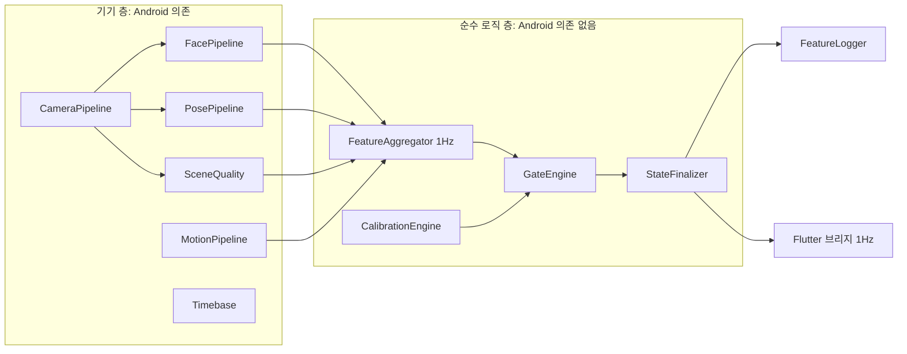

# v0 작업 분해와 ground-truth 검증 규칙

v0.2.0 기준 · 2026-09-19

## 1. 전제와 범위

v0는 Android에서 G1·G2·폰 사용 게이트가 실제 사람의 행동과 초 단위로 맞는지를 로그로 증명하는 단계다. 눈 지표, 점수, 절전은 v0의 합격 기준이 아니다.

**구현 스택**

| 항목 | 결정 |
| --- | --- |
| 앱 구조 | Flutter 앱 + 플랫폼별 네이티브 측정 엔진 |
| 1차 플랫폼 | Android. Kotlin + CameraX + MediaPipe Tasks Vision |
| 2차 플랫폼 | iOS. Swift + AVFoundation + MediaPipe Tasks. Android v0가 통과한 뒤에 시작 |
| 경계 | Flutter에는 영상 프레임을 넘기지 않는다. 약 1Hz의 state, coverage, 세션 통계, 캘리브레이션 상태만 전달 |
| 브리지 | Pigeon (또는 MethodChannel + EventChannel) |
| 장시간 실행 | camera 타입 foreground service. 화면이 보이는 상태에서 시작 |
| 로컬 기록 | Room/SQLite에 초당 레코드와 interval 레코드. 재생 테스트용 JSONL 내보내기 |
| 서버 | 기존 Supabase 유지. 업로드는 세션 종료 후 1회 |

Android를 먼저 하는 이유는 화면을 끄고 측정하는 것이 제품의 기본 사용 방식이고, 그 가정이 Android에서만 성립하기 때문이다. G1·G2는 실기기에서 바뀔 가능성이 높아서, 두 플랫폼을 동시에 구현하면 같은 수정을 매번 두 번 해야 한다.

**v0 범위**

| 포함 | 제외 (v1 이후) |
| --- | --- |
| 카메라·시간 기준·IMU·foreground service | EAR 구간 로직, PERCLOS, 감김 사건 |
| Face/Pose raw feature 기록 | G3 수면, W1·W2·W4·W5, DROWSY |
| 캘리브레이션 (작업영역 최대 3개, torso ROI, scene 기준, 거치 자세) | 0–100 점수, 재정규화, coverage 조건 |
| G1 (ABSENT, PRONE, INVALID), G2 (AWAY), 폰 사용 게이트 | 그림자 지표 분석, 프로브 |
| 판정 순서, raw\_state / final\_state, 30초 소급, lifecycle gap | 전력 상태 머신 P1\~P5, 발열 사다리 |
| 초당 기록 스키마, 세션 header, 로그 재생 | iOS |
| ground-truth 대조 도구 | 전력 합격선 (실측 기록만 남김) |

v0의 상태 어휘는 PHONE, INVALID, ABSENT, PRONE, AWAY, PRESENT 여섯 개다. PRESENT는 v0.2.0의 DROWSY와 FOCUS를 합친 자리로, "게이트가 아무것도 확정되지 않았고 얼굴이 작업영역 안에 있음"을 뜻한다.

## 2. 모듈 경계

네이티브 엔진을 "기기에 닿는 층"과 "순수 로직 층"으로 나눈다. 순수 로직 층은 카메라 없이 저장된 feature 시퀀스만으로 다시 실행할 수 있어야 한다.



| 모듈 | 책임 | 층 |
| --- | --- | --- |
| Timebase | 카메라, IMU, 앱 clock을 하나의 monotonic 기준으로 환산 | 기기 |
| CameraPipeline | CameraX 바인딩(서비스 lifecycle), fps 설정, 프레임 스케줄러(Face 전 프레임, Pose 1/3fps), 프레임 drop 계수 | 기기 |
| FacePipeline | Face Landmarker, head pose, 얼굴 폭, 강체 잔차 j | 기기 |
| PosePipeline | 어깨, 머리 landmark, torso ROI 일치 판정 재료 | 기기 |
| SceneQuality | Y 평균, 배경 tile texture (1–2Hz) | 기기 |
| MotionPipeline | IMU 5Hz, 집어 듦·흔들림·재거치 재료 | 기기 |
| FeatureAggregator | 프레임·센서 값을 초당 레코드와 사건으로 집계 | 로직 |
| CalibrationEngine | 작업영역, torso ROI, scene 기준, 거치 자세 계산과 스냅샷 | 로직 |
| GateEngine | 판정 순서, G1, G2, 폰 사용 | 로직 |
| StateFinalizer | raw\_state, 30초 소급 버퍼, final\_state, lifecycle gap interval | 로직 |
| FeatureLogger | 확정 레코드 배치 기록, 세션 header, 프로세스 종료 복구 | 기기 |

- 순수 로직 층은 Android API와 `java.*` 의존 없이 Kotlin만으로 작성한다. JVM 단위 테스트와 로그 재생이 바로 되고, iOS로 갈 때 Kotlin Multiplatform으로 같은 코드를 공유할 선택지가 남는다. 게이트 로직을 Swift로 다시 쓰면 v0.2.x 튜닝 때마다 두 번 고치게 된다.
- 로직 층의 입력은 기록 스키마와 같은 형태여야 한다. 실시간 경로와 재생 경로가 같은 함수를 지난다.
- 요청 fps와 실제 처리된 프레임 수를 구분해서 기록한다. MediaPipe live-stream 모드와 CameraX의 최신 프레임 유지 전략은 둘 다 바쁠 때 프레임을 버린다.

## 3. 선행 리스크 스파이크

작업 분해에 들어가기 전에 실기기(Galaxy S26을 포함해 2종 이상)에서 아래 가정을 먼저 확인한다. 하나라도 깨지면 Android 우선 전제나 스펙 수치를 다시 봐야 한다.

| # | 가정 | 확인 방법 | 깨지면 |
| --- | --- | --- | --- |
| R1 | 화면을 끄고 잠근 상태에서도 camera foreground service가 프레임을 계속 받는다 | 빈 분석기로 30분 실행하고 프레임 간격을 기록. 제조사 절전 설정(잠자기 앱, 배터리 최적화)별로 반복 | 화면 on + 블랙 UI로 후퇴. 전력 추정과 제품 사용 방식이 바뀐다 |
| R2 | 24fps 고정이 된다 | 지원 fps 범위를 조회하고 Camera2Interop으로 \[24, 24\]를 설정한 뒤 실측 | 30fps 캡처 + 전 프레임 처리 (스펙 7장) |
| R3 | 카메라 timestamp를 elapsedRealtime 기준으로 환산할 수 있다 | 센서 timestamp source 확인. 기준이 다르면 세션 시작 때 offset을 추정하고 30분 drift를 측정 | Timebase에 주기적 재추정 추가 |
| R4 | Face 24fps + Pose 1–3fps가 CPU에서 돈다 | 30분 실행. 처리 프레임 수, 추론 지연, thermal status 기록 | 해상도 하향, Pose cadence 조정 |
| R5 | 낮은 거치 위치에서 숙인 자세와 엎드림 때 Pose가 어깨와 머리 landmark를 낸다 | 3명 × 거치 위치 2종. 어깨·코·귀 5점의 visibility와 정규화 좌표만 개발 기기의 로컬에 기록하고, 확인 뒤 삭제한다. 데이터 경계의 명시적 예외다: DEBUG·GT 검증 빌드 전용, 릴리스 빌드 불가, 서버 전송 금지 (본문 9장) | G1 엎드림 규칙의 실효성 재검토. 무효 + 자동 일시정지 경로의 비중이 커진다 |
| R6 | 프로세스가 죽어도 기록이 남는다 | 강제 종료, 메모리 압박, 재부팅 뒤 복구 확인 | FeatureLogger의 flush 주기 단축 |

- R1이 가장 위험하다. Android 우선의 근거가 여기에 걸려 있다. 가장 먼저, 작은 스파이크 앱으로 확인한다.
- CameraX는 Activity가 아니라 서비스의 lifecycle에 바인딩한다. Activity가 사라져도 측정이 이어져야 한다.
- 스파이크 결과는 기기 모델, OS 버전과 함께 남긴다.

## 4. 작업 분해

단계마다 "어떤 로그가 나오면 통과인가"를 먼저 정하고 구현한다. 시나리오 번호(T1\~T11)는 6장, 합격선 수치는 7장을 따른다.

| 단계 | 작업 | 산출 로그 | 통과 기준 |
| --- | --- | --- | --- |
| V0-A Camera/Clock | camera foreground service, CameraX ImageAnalysis 24fps(Camera2Interop), 최신 프레임 유지 전략, Timebase, IMU 5Hz, 세션 header, 초당 레코드 골격 | 프레임 capture timestamp와 간격, 요청·처리 프레임 수, IMU 표본, t\_mono\_ms·t\_utc\_ms | 화면을 끈 채 60분 연속 실행. 프레임 간격 > 80ms인 비율 < 1%, 초당 레코드 누락 0, t\_mono 단조 증가 |
| V0-B Raw feature | Face Landmarker(num\_faces = 1), head pose, 얼굴 폭, 강체 잔차 j, Pose lite 1fps(얼굴 미검출 중 3fps), SceneQuality | 초당 yaw·pitch·roll, 얼굴 검출 비율, 어깨 visibility, torso 중심·폭, 머리 landmark 유무, scene 휘도, tile texture, j | 판정 없이 로그만 남긴다. 정면 착석 10분에서 얼굴 검출 ≥ 99%, 정지 자세의 yaw·pitch 표준편차 < 2° |
| V0-C Calibration | 자료 위치 등록(최대 3개), torso ROI, scene 기준, 거치 자세(중력 벡터, 가속도 분산), 스냅샷 저장, 세션 중 1탭 영역 추가 | calibration\_id와 스냅샷 전체 | 같은 자세로 3회 반복했을 때 영역 중심 차이 < 3°. 스냅샷만으로 세션을 재생할 수 있다 |
| V0-D G1 | 판정 순서 2\~4번, scene INVALID, ABSENT 3초, PRONE 30초, 머리 landmark 없음 → INVALID + 30초 알림 + 120초 자동 일시정지·재개, 해제 히스테리시스, torso ROI 일치 | raw\_state, G1 후보 시작 시각, 일시정지 구간 | T2, T3, T4, T7, T8 합격 |
| V0-E G2 | 작업영역 판정, 4초 유예, 단기·장기 AWAY, 영역 geometry 고정, 5분 50% 재등록 안내 | 작업영역 id 또는 밖, 이탈 지속시간 | T1, T6 합격 |
| V0-F Phone gate | 집어 듦(15°, 분산 3배, 3초), 3초 미만 흔들림 → INVALID, 재거치 확정(±10° 복귀 또는 탭, 60초 규칙), 잠금 해제 + 앱 비포그라운드 → PHONE, 알림으로 켜진 화면 제외 | IMU 상태, 앱·화면 상태, 재거치 사건 | T5, T9 합격 |
| V0-G Finalizer | raw\_state / final\_state 분리, 30초 확정 버퍼, 소급 표, lifecycle gap interval, 프로세스 종료 복구, 확정 레코드만 배치 기록, JSONL 내보내기, JVM 재생 러너 | final\_state, interval 레코드, 세션 종료 사유 | 같은 로그를 재생하면 final\_state가 완전히 같다. T10 합격 |
| V0-H GT 도구 | 큐 재생기, GT 파일 파서, 초 단위 diff, 혼동 행렬·검출 지연·flapping 리포트 | 세션별 대조 리포트 | 합격·불합격을 자동으로 출력한다 |

**실행 순서**

A → B → H → C → G(골격) → D → E → F → G(나머지) 순으로 한다.

- H를 게이트 구현 앞으로 당긴다. 큐 재생기와 diff 도구가 먼저 있어야 D·E·F를 시나리오 합격선에 맞춰 개발할 수 있다. H를 마지막에 두면 첫 구현이 "성공 기준 없이" 만들어진다.
- G의 골격(확정 버퍼와 소급 표)은 D보다 먼저 필요하다. ABSENT와 PRONE의 소급이 상태 비율을 바꾸기 때문에, 소급 없이 대조하면 같은 구현이 다른 결과를 낸다.
- lifecycle gap과 프로세스 복구는 게이트가 끝난 뒤에 붙인다.
- Flutter 쪽은 캘리브레이션 화면, 세션 시작·종료, 1Hz 상태 표시, 시나리오 선택 화면만 만든다.

## 5. ground-truth 타임라인 규칙

GT는 영상을 녹화하지 않고 만든다. 앱이 큐(음성·비프)를 내고 그 시각을 측정과 같은 monotonic clock으로 기록한다. 사람이 시계를 보고 적은 시각을 앱 시각에 맞추는 문제가 없어진다.

**GT의 종류**

| 종류 | 만드는 법 | 쓰임 |
| --- | --- | --- |
| 대본 GT | 앱이 시나리오 대본대로 큐를 낸다("지금 자리를 비우세요", "돌아와 앉으세요"). 큐 시각이 GT의 전이 시각이다 | 합격선 판정 |
| 관찰 GT | 자유 공부 세션을 관찰자가 보조 기기의 버튼으로 찍는다. 세션 시작 때 두 기기가 같은 큐로 시각을 맞춘다 | 대본에 없는 실제 행동에서 오탐을 찾는다. 합격선에는 쓰지 않는다 |

**행동과 기대 상태를 따로 적는다**

- `behavior`: 사람이 실제로 한 행동 (예: study\_in\_zone, leave\_seat, deep\_bow\_writing).
- `expected_state`: v0.2.0 스펙대로면 시스템이 내야 하는 상태. PRESENT, AWAY, ABSENT, PRONE, PHONE, INVALID, PAUSED 중 하나.
- 채점은 expected\_state와 final\_state를 비교한다. 이것은 "구현이 스펙과 맞는가"를 본다.
- behavior는 "스펙이 현실과 맞는가"를 보는 데 쓴다. 예를 들어 깊이 숙여 필기하는 구간의 기대 상태는 INVALID인데, 이 구간이 세션의 큰 비중을 차지하면 구현이 아니라 스펙(거치 위치, G1 규칙)을 고쳐야 한다.

**시간 규칙**

- 전이 시각은 큐의 t\_mono\_ms다. 파일에는 세션 시작 큐 기준 상대 시각(ms)으로 적는다.
- expected\_state는 대본의 행동 구간에 스펙 규칙을 적용해 도구가 생성한다. 손으로 적지 않는다. 예: 이탈 행동의 처음 4초는 유예라서 기대 상태가 PRESENT이고, 머리가 안 보이는 저움직임은 120초부터 PAUSED다.
- 반응 허용 구간: 각 큐 뒤 3초는 채점에서 뺀다. 큐를 듣고 행동을 마치는 시간이다.
- 게이트의 확정 지연(ABSENT 3초, PRONE 30초, PHONE 3초)은 final\_state의 소급이 흡수하므로 따로 허용하지 않는다. 검출 지연은 raw\_state로 별도 측정한다.
- 대본의 각 행동은 확정 시간의 2배 이상 유지한다 (ABSENT·PHONE·AWAY 10초 이상, PRONE 60초 이상). 경계 조건을 보는 시나리오만 예외다.

**파일 형식**

```json
{
  "session_id": "...",
  "scenario_id": "T2",
  "gt_type": "scripted",
  "start_cue_t_mono_ms": 123456,
  "intervals": [
    {"t_start_ms": 0, "t_end_ms": 120000,
     "behavior": "study_in_zone", "expected_state": "PRESENT"},
    {"t_start_ms": 120000, "t_end_ms": 180000,
     "behavior": "leave_seat", "expected_state": "ABSENT"}
  ],
  "void": [{"t_start_ms": 300000, "t_end_ms": 320000, "reason": "큐를 놓침"}]
}
```

**작성 규칙**

1. 큐는 앱이 낸다. 사람이 시계를 보고 시각을 적지 않는다.
2. 한 세션에는 정해진 시나리오 묶음만 넣는다.
3. 참가자가 큐를 놓치거나 다르게 행동한 구간은 관찰자가 void로 표시하고 채점에서 뺀다.
4. GT 파일은 세션 로그와 같은 session\_id로 묶어 보관한다. parameter\_set\_id와 함께 회귀 테스트 자산이 된다.

## 6. 검증 시나리오

대본 GT로 돌리는 시나리오 11개다. 각 시나리오는 "잡아야 하는 것"과 "잡으면 안 되는 것"을 짝으로 둔다.

| # | 시나리오 | 행동 | 기대 상태 |
| --- | --- | --- | --- |
| T1 | 기본 공부 10분 | 등록한 두 영역(책, 노트북)을 오가며 공부, 필기 포함 | 전 구간 PRESENT. 거짓 AWAY·ABSENT·INVALID와 flapping을 본다 |
| T2 | 자리 비움 | 2초 일어났다 앉기 / 10초 비움 / 60초 비움 | 2초는 ABSENT가 아니다. 10초와 60초는 ABSENT이고 후보 시작 시각까지 소급된다 |
| T3 | 깊이 숙여 필기 3분 | 얼굴은 안 보이고 어깨는 움직인다 | INVALID. ABSENT 0초, PRONE 0초 |
| T4 | 엎드림 | (a) 머리가 프레임에 남는 엎드림 60초 (b) 머리가 프레임 밖인 엎드림 150초 | (a) PRONE, 시작 시각까지 소급 (b) INVALID, 30초에 알림, 120초부터 PAUSED, 복귀 3초 뒤 자동 재개 |
| T5 | 폰 | (a) 집어 들어 20초 사용 후 원위치 (b) 집어서 평평한 곳에 두고 90초 사용 (c) 책상 충격 1–2초 | (a) 집어 든 시각부터 PHONE, 원위치 뒤 재캘리브레이션 구간은 INVALID (b) 재거치로 확정하지 않는다. 60초까지 INVALID, 이후 PHONE (c) INVALID. PHONE이 아니다 |
| T6 | 이탈 | (a) 등록 안 된 방향 3초 (b) 10초 (c) 30초 (d) 등록한 세 번째 영역 30초 (e) 머리는 영역 안, 눈만 돌려 20초 | (a) PRESENT (b) 처음 4초 PRESENT, 이후 AWAY (c) AWAY (d) PRESENT (e) PRESENT. eyeLook은 그림자 기록만 한다 |
| T7 | 환경 | (a) 불 끄기 30초 (b) 카메라를 손으로 가림 10초 (c) 매끈한 배경에서 자리 비움 30초 | (a) INVALID (b) INVALID (c) ABSENT. 가림으로 오분류하지 않는다 |
| T8 | 빈 의자 | 의자에 옷을 걸어 두고 60초 비움 | ABSENT. torso ROI 오탐이 없다 |
| T9 | 앱·화면 | (a) 잠금 해제 후 다른 앱 30초 (b) 알림으로 화면만 켜짐 (c) 거치한 채 화면을 터치해 다른 앱 사용 | (a) PHONE (b) 상태 변화 없음 (c) PHONE |
| T10 | 프로세스·lifecycle | 세션 중 앱 강제 종료 후 재실행 | 세션이 마지막 기록 시각으로 닫힌다. 확정 레코드 손실은 배치 주기(60초) 이내 |
| T11 | 조건 변형 | 안경, 모자, 마스크, 스탠드 조명만 켠 저조도, 측면 30° 거치, 눈높이 위 거치로 T1·T2 반복 | 합격선 없음. 상태별 INVALID 비율을 기록해 스펙 8장 검증 항목의 자료로 쓴다 |

- 참가자 3명 이상 × 거치 위치 2종 × 기기 2종으로 돌린다. 시나리오마다 2회 이상 반복한다.
- T1은 다른 시나리오 사이사이에 2분 이상 넣는다. 복귀 뒤 상태가 PRESENT로 제대로 돌아오는지 본다.

## 7. 대조 방법과 v0 합격선

final\_state와 expected\_state를 초 단위로 비교한다. 반응 허용 구간과 void 구간은 뺀다.

**리포트 항목**

1. 혼동 행렬 (초 수).
2. 상태별 precision과 recall.
3. 세션별 상태 비율 오차 (측정 − 기대, %p).
4. 검출 지연: 큐부터 raw\_state 전이까지의 시간. 중앙값과 P95.
5. flapping: 기대 상태가 일정한 구간 안에서 final\_state가 바뀐 횟수.
6. 거짓 INVALID: 기대 상태가 INVALID가 아닌데 INVALID인 초의 비율.

리포트는 시나리오별, 참가자별, 기기별로 쪼갠다. 평균만 보면 한 사람이나 한 거치 위치에서만 깨지는 문제가 가려진다.

**단순 판정 baseline과의 비교**

같은 입력 로그에 단순 판정과 현 알고리즘을 재생으로 돌려 숫자로 비교한다. 추가 촬영이 필요 없다.

| 대상 | 단순 baseline | 비교 지표 | 시나리오 |
| --- | --- | --- | --- |
| 관측 실패의 단계적 분리 (G1, scene 판정) | 얼굴 미검출 3초 → ABSENT | false ABSENT 초, false INVALID 초, missed ABSENT 초 | T2, T3, T4, T7, T8 |
| 폰 사용 게이트와 재거치 | 단순 IMU rest detector. 정지하면 정상 측정으로 복귀 | missed PHONE 초, 거짓 재거치 확정 횟수, 재거치 뒤 기준 불일치로 생긴 false AWAY 초 | T5a, T5b, T5c |

결과는 세션의 parameter\_set\_id, GT 파일과 함께 보존한다. "단순 판정이 실패하는 상황에서 오분류가 사라졌다"는 비교가 기술적 효과의 자료가 된다.

**v0 합격선**

| 항목 | 기준 |
| --- | --- |
| ABSENT | recall ≥ 95%, precision ≥ 95% (T2, T7c, T8) |
| 2초 자리 비움 (T2) | ABSENT 0초 |
| 깊이 숙여 필기 (T3) | ABSENT 0초, PRONE 0초 |
| PRONE (T4a) | recall ≥ 90% |
| PAUSED (T4b) | 120초 ± 3초에 일시정지, 복귀 뒤 5초 안에 재개 |
| PHONE | recall ≥ 95%, precision ≥ 95% (T5a, T9a, T9c). 책상 충격(T5c)과 알림(T9b)에서 PHONE 0초 |
| 평평한 곳에 두고 사용 (T5b) | 재거치 확정 0회 |
| AWAY | T6b·c에서 recall ≥ 90%. T1과 T6a·d·e에서 거짓 AWAY ≤ 1% |
| 환경 | T7a·b에서 ABSENT 0초. T7c에서 camera\_occluded 0초 |
| 거짓 INVALID (T1) | ≤ 5% |
| flapping | 기대 상태가 일정한 구간에서 10분당 1회 이하 |
| 검출 지연 (raw\_state, P95) | ABSENT ≤ 5초, PHONE ≤ 5초, AWAY ≤ 6초 (4초 유예 포함) |
| 상태 비율 오차 | 세션당 각 상태 ± 3%p 이내 |
| 재현성 | 같은 로그를 재생하면 final\_state가 100% 일치 |
| T10 | 세션이 닫히고 확정 레코드 손실이 60초 이내 |

- 수치는 제안값이다. 첫 실측 분포를 보고 한 번 조정한 뒤 parameter\_set\_id와 함께 고정한다.
- 합격선은 "구현이 스펙과 맞는가"만 본다. behavior 기준으로 드러난 문제(예: 필기 중 INVALID가 세션의 30%)는 불합격이 아니라 v0.2.x 변경 후보로 기록한다.
- 불합격이 나오면 그 세션의 로그와 GT를 테스트 케이스로 저장한다. 수정 뒤 재생 러너로 회귀를 돌리고 실기기로 다시 확인한다.
